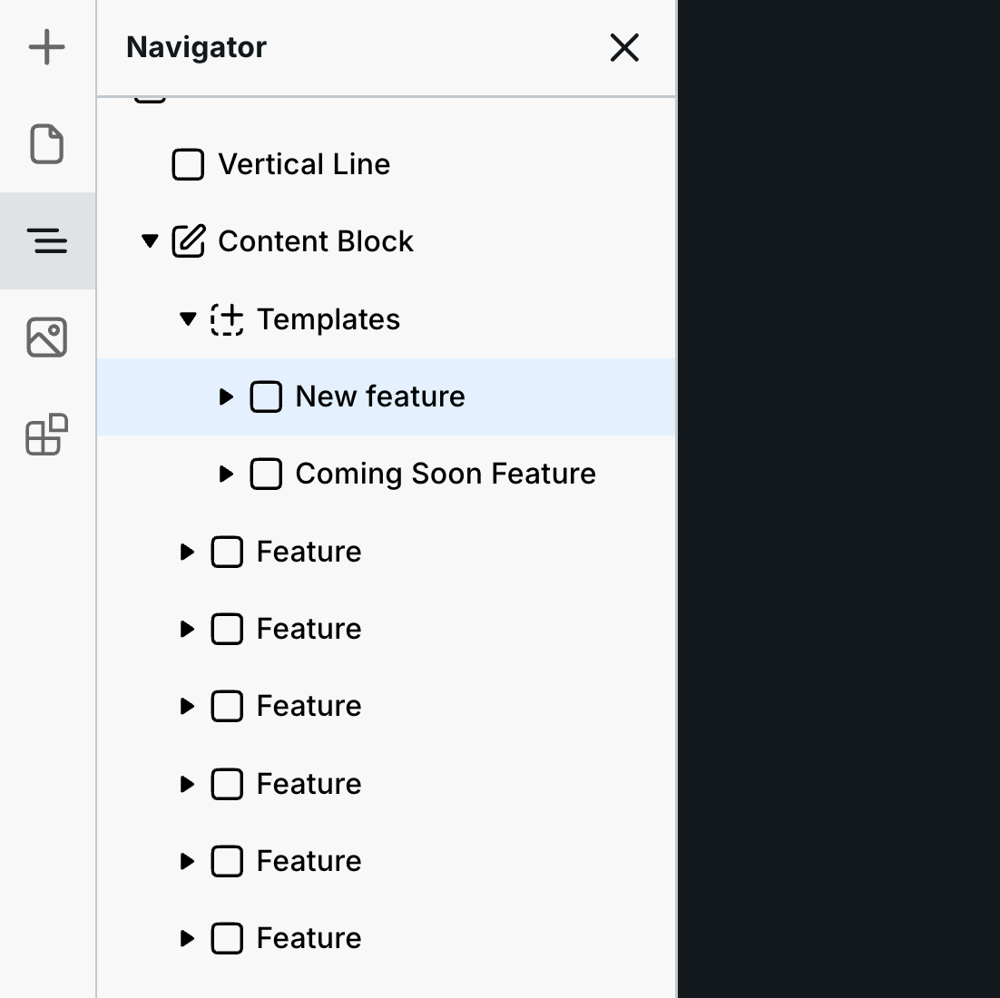
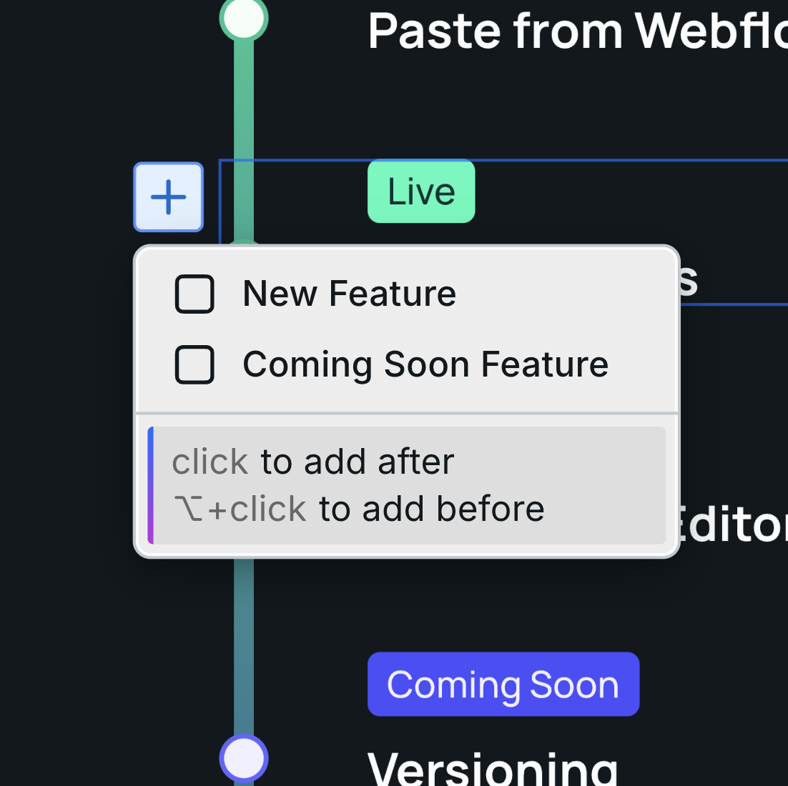
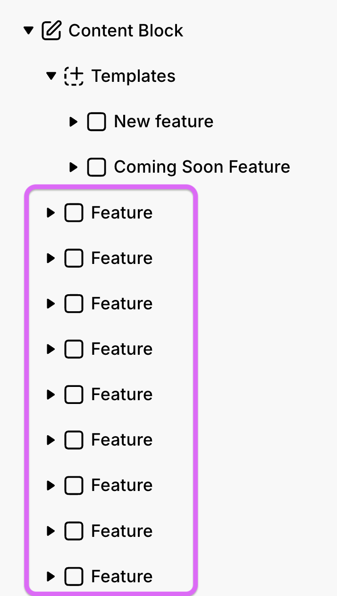
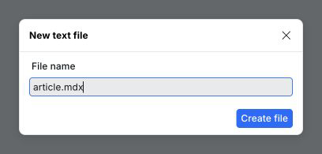
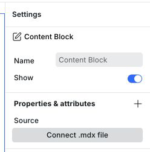
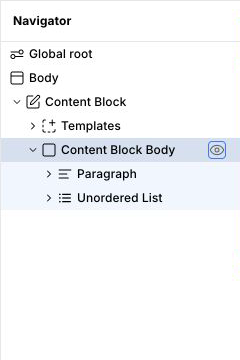
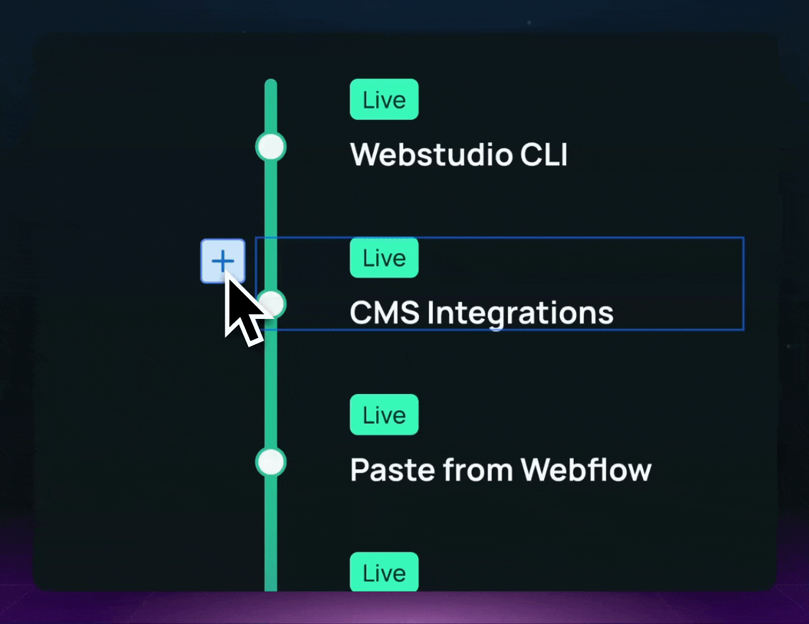

# Content Block

[Content _mode_](../foundations/modes.md#content) enables editing existing content only inside Content Blocks. Content outside a Content Block is read-only for editors. Content Blocks also let editors add _new_ content.

Content Block enables adding new content — not just any content, but specifically inserting new instances predefined in Templates.

Designers can create a library of templates, from little cards to fully built sections, and editors can insert instances of these pre-styled templates and modify their content.

Next is a breakdown of Content Block by mode:

1. [Design mode](content-block.md#content-block-in-design-mode) ⬇️
2. [Content mode](content-block.md#content-block-in-content-mode) ⬇️

## Content Block in Design mode

Sometimes providing team members or clients the ability to edit existing content doesn’t help them accomplish everything they need.

Instead, they may want to add new content without asking you.

Content Block enables you to define regions on the site where editors can add instances of templates that you create.

Next is how to use it.

### Step 1: Add Content Block

Add the Content Block to the various regions you want editors to insert new content.

For example, you can add it to a place on the page where entirely new sections can be added, or you can add it within a section for them to add additional content to.

### Step 2: Add templates

Notice that the child of Content Block is Templates.&#x20;

Drag/build the various instances you want to provide editors here.

A Content Block must have exactly one direct Templates container. A missing or second Templates container makes the block invalid. Connected MDX content does not resolve or publish until you restore that structure.

For example, your client wants to update the section under the hero with the latest promotion. Sometimes the promotion is for an event while other times it’s a product. You can create those two designs, add them to “Templates” within Content Block, and your client can insert instances of the desired template and edit its content.


Editors don’t have access to the Style Panel, so be sure to provide fully designed templates.


Reusable top-level templates appear in Content mode like this. Structural and inline templates supplied for MDX styling, such as table cells and emphasis, do not appear as standalone insertion choices.

<div><figure><figcaption><p>Templates in Design mode</p></figcaption></figure> <figure><figcaption><p>Template in Content mode</p></figcaption></figure></div>


Each time they insert a template, its copy appears inside the Content Block's Body outlet, alongside any initial body content. The Templates container remains protected source material.

### Step 3: Add an initial setup (optional)

Optionally, you can add instances inside the Content Block's Body outlet.

<figure><figcaption><p>The Feature instances are provided as a starting point</p></figcaption></figure>


Doing so will provide an initial setup for editors.

Editors can delete children of the Body outlet. They cannot delete the designed shell, Templates container, templates, or nested instances independently.

### Store content in an MDX file

Connect a `.mdx` file when the Content Block's body should live in Assets instead of the project's regular instance data. The designed shell and Templates list remain in the project. Markdown `.md` files cannot be connected to a Content Block.

#### Prepare the Content Block

1. Add the Content Block and design its shell in Design mode.
2. Place the **Body** outlet where the article body should render.
3. Keep exactly one direct **Templates** container. Style the standard document elements already provided inside it.
4. Add any reusable custom content to **Templates**.
5. Give every custom top-level template a unique instance name. Use a JSX-compatible name such as `PromotionCard` when you want component-style JSX.

New Content Blocks already include a Body outlet and direct templates for every supported Markdown element, including headings, paragraphs, marks, links, images, quotes, lists, task controls, code, separators, and tables. When you connect an older Content Block without a Body outlet, Webstudio adds it automatically.

#### Create and connect the file

1. Open **Assets**, select **Create text file**, and create a file ending in `.mdx`.
2. Select the Content Block in Design mode.
3. Under **Properties & attributes**, select **Connect .mdx file** for **Source**.
4. Select the file, or bind **Source** to an expression that returns an MDX Asset ID.
5. If the Content Block already has body content, review the warning and confirm the connection. The file replaces the existing Body children.

<figure>
  <picture>
    <source srcset="../../.gitbook/assets/create-mdx-file-dark.png" media="(prefers-color-scheme: dark)">
    
  </picture>
  <figcaption><p>Change the default filename so that it ends in <code>.mdx</code>.</p></figcaption>
</figure>

<figure>
  <picture>
    <source srcset="../../.gitbook/assets/connect-content-block-mdx-dark.png" media="(prefers-color-scheme: dark)">
    
  </picture>
  <figcaption><p>Connect the file from the Content Block's Source property.</p></figcaption>
</figure>

Select the connected filename to choose another file. Select **Open** to edit the current file. In Content mode, editors can see the filename and open it, but only a designer can connect, switch, bind, or disconnect the source.

#### Edit the body in Content mode

Edit the connected body with the usual Content mode controls. You can change text and supported properties, insert templates, reorder content, and delete content. Canvas changes appear immediately and then save to the MDX file.

Component properties in Content mode are limited to authored content, such as links, media sources and alternative text, form labels and placeholders, code, and date values. Layout, dimensions, visual themes, form wiring, and interaction settings remain available only in Design mode.

If the file changes after a canvas edit starts but before it is saved, reload the Content Block before continuing. Webstudio keeps the local canvas state until reload and does not silently merge or overwrite either version.

#### Write Markdown and MDX

An `.mdx` file supports standard Markdown and constrained JSX in one document.

Write headings, paragraphs, links, lists, tables, code, images, and other standard document content as Markdown. Each node uses the uniquely matching semantic template from the Content Block when one exists. Matching uses the element tag or adapted component type, not the template's editable label. If no standard template exists, Webstudio renders the normal semantic fallback. The fallback is still a normal element or component, so its applicable component and global styles continue to work; it simply has no Content Block template styles. If more than one standard template matches, Webstudio reports a warning and uses the fallback.

Use lowercase JSX when Markdown cannot express the required HTML element or attributes:

```mdx
<section aria-label="Launch details">
  <h2>Launch offer</h2>
</section>
```

Use a capitalized JSX name for a uniquely named custom template:

```mdx
# Product update

Regular document content stays Markdown and uses the matching standard templates.

<PromotionCard tone="featured">
  ## Launch offer
</PromotionCard>
```

The JSX name first matches the stable **Name** of a unique top-level template in the Content Block's Templates list. **Name** is a JavaScript identifier and is separate from the optional **Label** shown in the canvas. If no template has that name, Webstudio uses the exact registered component with that exported name. A new template gets its default name from its root component or HTML tag, and duplicate defaults get deterministic numeric suffixes.

When two component libraries export the same name, the core component keeps the plain identifier and the namespaced component gets a stable library prefix, such as `Checkbox` and `RadixCheckbox`. Component discovery reports the exact JSX identifier to use.

JSX attributes accept quoted static values and bare booleans. Webstudio converts quoted values to the property's declared string, number, or boolean type when possible. Imports, exports, expressions such as `{false}`, spreads, functions, and executable JavaScript are not supported. Internal forms such as `<ws.element>`, `ws:name`, `ws:tag`, `ws:label`, and `<$.*>` are not current authoring syntax.

An explicit JSX child tree that matches the designed template structure overlays its text and supported properties onto the cloned template descendants. Their template styles and structure stay intact. If the child structure does not match, the explicit children replace the template root's default children and each authored child resolves through a matching template when possible. An empty pair such as `<PromotionCard></PromotionCard>` clears the defaults, while a self-closing reference such as `<PromotionCard />` keeps them. If you edit inherited default content in Builder, Webstudio writes that content as explicit JSX children so the edit persists without changing the template.

Template resolution is live. If the file already contains `<PromotionCard />` or a Markdown element that has no matching template, adding the template later updates the rendered content without rewriting the MDX file. This also applies to elements added to an explicit JSX child tree. Renaming or removing a template re-resolves the same source.

If a Content Block that already renders connected MDX temporarily has zero or multiple Templates containers, Builder keeps the last valid rendered content and reports the structural error. Fixing the container structure resolves the current MDX again automatically.

Missing or duplicate custom templates show a source-ranged warning and a selectable placeholder in Builder. Published pages omit only the unresolved custom subtree. Invalid or unsupported MDX remains editable; Builder reports the source location and renders the valid content it can recover.

Legacy files that already contain internal `ws.element`, `ws:name`, or `$.*` syntax remain readable during migration, but Webstudio does not emit or recommend those forms.

Keep custom template names stable after connecting MDX files. Webstudio prevents duplicate top-level template names. Renaming or deleting a referenced template warns that connected files will not be rewritten. If you continue, update the affected JSX references in the MDX files. An MCP-connected agent can preview and confirm that update across a selected group of files. A confirmed rename changes the reference name. A confirmed removal unwraps and preserves explicit authored children; a self-closing reference disappears because it has no authored children.

#### Use frontmatter in the designed shell

Edit frontmatter as YAML in the MDX file editor. Visual body edits preserve the frontmatter source, including comments and formatting.

Store every frontmatter image as an exact `$ref` object so it resolves to structured Asset metadata:

```yaml
featureImage:
  $ref: ./images/feature.png
```

To use frontmatter in the designed part of a Content Block, [bind](../foundations/variables.md) a property or text value to the Content Block's **document** variable. For example, bind a heading to `document.frontmatter.title`, an Image source to `document.frontmatter.featureImage.src`, and its alternative text to `document.frontmatter.featureImage.description`. This uses the image's Asset description instead of duplicating alternative text in frontmatter. Direct frontmatter bindings remain part of the same MDX file and can be edited on the canvas in Content mode. Computed expressions and values supplied through another document's `$ref` remain read-only on the canvas; open the referenced file to edit referenced values.

#### Use one file in repeated or shared content

For a Content Block inside a Collection, bind **Source** to the current item's MDX Asset ID. Each Collection item then opens and edits its own file.

You can also connect multiple Content Blocks to the same MDX file. Editing the file or any connected occurrence updates every other occurrence.

When you copy a connected Content Block, page, template, or folder to another project, Webstudio copies the MDX file and the local files it references. The pasted Content Block points to those imported copies. If Webstudio cannot parse the MDX, it preserves the source file and reports that its dependencies could not be collected.

To create another post with the same structure, duplicate the existing MDX Asset, edit the duplicate, and connect or bind the appropriate Content Block occurrence to it.

#### Disconnect the file

In Design mode, select the **Source** property label and choose **Reset value**. Disconnecting leaves the MDX file unchanged, removes its body from the canvas, and keeps the designed shell and Templates list with an empty Body outlet. If the source is bound inside a Collection, review the warning before confirming: resetting the shared Source property disconnects every Collection occurrence.

## Content Block in Content mode

In [Content mode](../foundations/modes.md#content), you can edit existing content inside Content Blocks. But what if you want to add _new_ content?

You can within Content Block — region(s) on the page the designer designates as a place you can add new content from building blocks to entire sections.

For example, on your homepage, you change out promotions. Sometimes they are events, and other times they are products. The designer can add the Content Block to that section on your homepage and provide you with an “Events template” and “Products template”. You can then insert instances of each template, delete them, and change out their content. The design is fully provided for you.

Next is how to use it.

### Step 1: Locate the region you want to change

On the left-hand side, there is the navigator showing you the various Content Blocks on the page.

<picture>
  <source media="(prefers-color-scheme: dark)" srcset="../../.gitbook/assets/content-blocks-navigator-dark.png">
  
</picture>


You can click on them to navigate to that part of the page.

### Step 2: Add template instances

Each Content Block can have a unique set of templates you can choose from.

On the canvas, hover where you want to insert, and the blue + button will appear. Click that, and you’ll see a list of templates provided by the designer.

<figure><figcaption><p>Templates the designer provided</p></figcaption></figure>


Select the one you want, and it’ll insert an instance/copy of that template.

Click into it to make changes. See more about editing content in [Content mode](../foundations/modes.md#for-editors).

### Step 3: Delete instances

You can delete a direct child of the Content Block in one of two ways:

1. The blue + button will turn into a red delete button if you hold the option/alt key on your keyboard.
2. Select the instance in the navigator, and press delete/backspace on your keyboard.

   <figure><figcaption><p>Hold Option or Alt</p></figcaption></figure>



You can’t delete the template itself, so you can always add it back.


Beyond adding new content, you can edit the existing content inside the Content Block. See [Content mode](../foundations/modes.md#content) for more information.

## Related

- [Slot](slot.md) – Reusable component slots
- [Modes](../foundations/modes.md) – Builder modes including Content mode
- [Collection](collection.md) – Iterate over dynamic data
