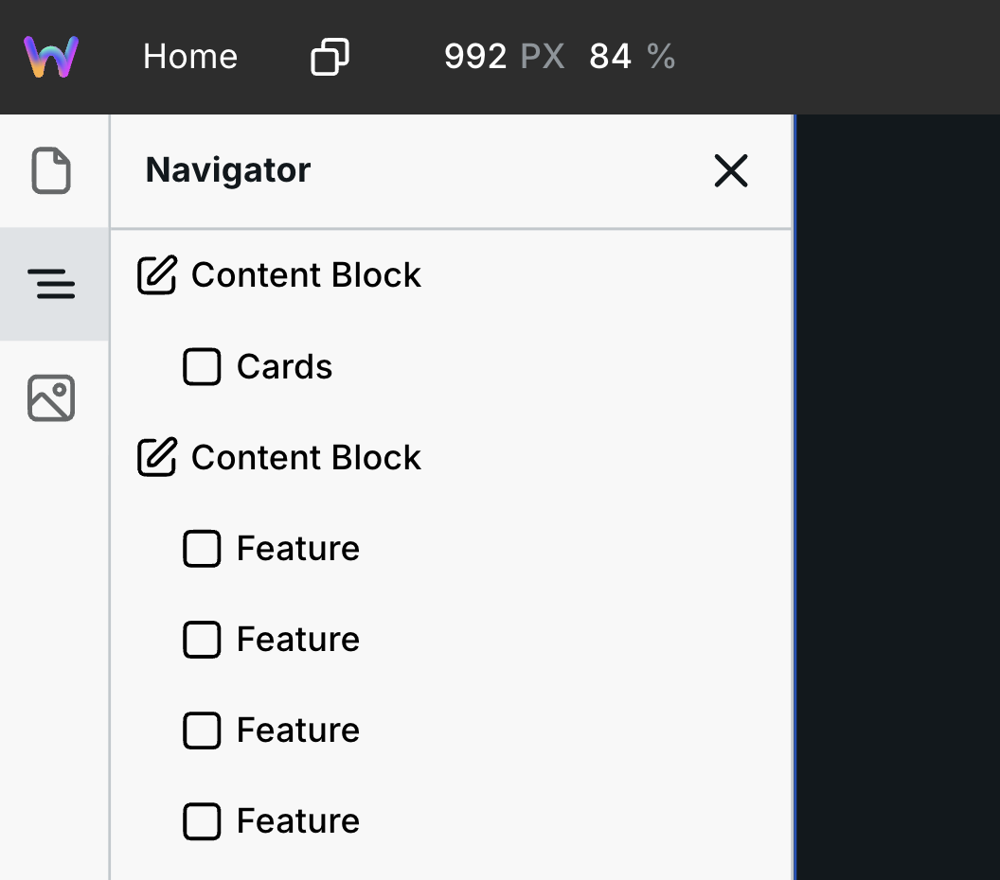

# Content Block

[Content _mode_](../foundations/modes.md#content) enables editing existing content only inside Content Blocks. Content outside a Content Block is read-only for editors. Content Blocks also let editors add _new_ content.

Content Block enables adding new content — not just any content, but specifically inserting new instances predefined in Templates.

Designers can create a library of templates, from little cards to fully built sections, and editors can insert instances of these pre-styled templates and modify their content.

Next is a breakdown of Content Block by mode:

1. [Design mode](content-block.md#content-block-in-design-mode) ⬇️
2. [Content mode](content-block.md#content-block-in-content-mode) ⬇️

## Content Block in Design mode

Sometimes providing team members or clients the ability to edit existing content doesn’t help them accomplish everything they need.

Instead, they may want to add new content without asking you.

Content Block enables you to define regions on the site where editors can add instances of templates that you create.

Next is how to use it.

### Step 1: Add Content Block

Add the Content Block to the various regions you want editors to insert new content.

For example, you can add it to a place on the page where entirely new sections can be added, or you can add it within a section for them to add additional content to.

### Step 2: Add templates

Notice that the child of Content Block is Templates.&#x20;

Drag/build the various instances you want to provide editors here.

For example, your client wants to update the section under the hero with the latest promotion. Sometimes the promotion is for an event while other times it’s a product. You can create those two designs, add them to Templates within the Content Block, and your client can insert instances of the desired template and edit its content.


Editors don’t have access to the Style Panel, so be sure to provide fully designed templates.


Every top-level instance within Templates will appear in Content mode like this:

<div><figure><figcaption><p>Templates in Design mode</p></figcaption></figure> <figure><figcaption><p>Template in Content mode</p></figcaption></figure></div>

Each time they insert a template, its copy appears as a direct child of the Content Block, alongside any initial content. The Templates container remains protected source material.

### Step 3: Add an initial setup (optional)

Optionally, you can add instances as direct children of Content Block.

<figure><figcaption><p>The "Feature" instances are provided as a starting point</p></figcaption></figure>

Doing so will provide an initial setup for editors.

Editors can delete direct children of the Content Block. They cannot delete the Templates container, templates, or nested instances independently.

## Content Block in Content mode

In [Content mode](../foundations/modes.md#content), you can edit existing content inside Content Blocks. But what if you want to add _new_ content?

You can within a Content Block—the region on the page where the designer allows new content, from small building blocks to complete sections.

For example, on your homepage, you change out promotions. Sometimes they are events, and other times they are products. The designer can add a Content Block to that section and provide an “Events template” and “Products template”. You can then insert instances of each template, delete them, and change out their content. The design is fully provided for you.

Next is how to use it.

### Step 1: Locate the region you want to change

On the left-hand side, there is the navigator showing you the various Content Blocks on the page.

<figure><figcaption></figcaption></figure>

You can click on them to navigate to that part of the page.

### Step 2: Add template instances

Each Content Block can have a unique set of templates you can choose from.

On the canvas, hover where you want to insert, and the blue + button will appear. Click that, and you’ll see a list of templates provided by the designer.

<figure><figcaption><p>Templates the designer provided</p></figcaption></figure>

Select the one you want, and it’ll insert an instance/copy of that template.

Click into it to make changes. See more about editing content in [Content mode](../foundations/modes.md#for-editors).

### Step 3: Delete instances

You can delete a direct child of the Content Block in one of two ways:

1. The blue + button will turn into a red delete button if you hold the option/alt key on your keyboard.
2. Select the instance in the navigator, and press delete/backspace on your keyboard.

   <figure><figcaption><p>Hold option/alt</p></figcaption></figure>


You can’t delete the template itself, so you can always add it back.


Beyond adding new content, you can edit the existing content inside the Content Block. See [Content mode](../foundations/modes.md#content) for more information.

## Use an MDX file as the content source

A Content Block can store its editable body in an `.mdx` file in Assets instead
of in the project tree. Editors still work with normal instances on the canvas:
they can type, use the + button, edit allowed props, reorder content, and delete
content. Webstudio saves those changes back to the file as MDX.

The Content Block and its protected Templates list remain in the project. The
file stores only the authored body, so there is never a second persisted copy of
the same children in the project.

### Connect a content source

Select the Content Block, then use **Content source** in its settings. You can:

- Choose an existing `.mdx` Asset.
- Create an empty `.mdx` Asset.
- Bind the source to an expression that resolves to an Asset ID. This supports
  route parameters, detail pages, and repeated Collection content. Each
  rendered scope keeps its own file and editing state.
- Convert an existing `.md` Asset to a new `.mdx` Asset.

Direct selection only accepts `.mdx`. A dynamic expression must also resolve to
an `.mdx` Asset; a missing, inaccessible, or different file type is reported as
a source error. An empty file produces an empty editable region where an editor
can type or use the + button.

Publishing a dynamic source requires a finite candidate set that Webstudio can
derive from the route, detail query, or repeated records. An external or
otherwise unbounded runtime source blocks publication instead of including
unrelated MDX Assets. Dynamic candidates can use read Resources when Webstudio
can select them once per route after base Resources load. Publication rejects
candidate action Resources, Collection-item-scoped selection with
candidate-local Resources, and source/resource dependency cycles.

When both the block and the selected file already have body content, choose
which one becomes authoritative:

- **Use file content** removes the block's persisted body and displays the
  selected file.
- **Replace file body with block content** writes the supported block body to
  the file, then removes the persisted body.

Webstudio never merges the two bodies implicitly. The file's frontmatter is
preserved when its body is replaced. If only one side has body content,
Webstudio selects that side automatically.


A lifecycle or semantic edit that must change project data and an Asset in one
atomic commit, or must coordinate several Asset writes, is currently blocked
before any change is saved. Keep the content in one file or choose **Use file
content** until atomic multi-storage commits are available.


### Convert Markdown to MDX

Choose **Convert Markdown** to preview the conversion before creating a file.
Webstudio converts everything it can, lists unsupported or unsafe parts, and
skips those parts in the preview. Review the complete converted source, then
choose **Create MDX file**. The original `.md` file is never changed.

Markdown and MDX are separate formats in Webstudio. A `.md` file keeps normal
Markdown behavior, including embedded HTML. An `.mdx` file uses the safe MDX
grammar described below. Changing only the extension does not convert the
content.

### Switch or disconnect a source

Use **Replace or switch** to select another `.mdx` file. Webstudio validates and
loads the new file before replacing the last usable canvas view. If both sides
have content, choose **Use file content** or **Replace file body with block
content** again.

Disconnecting always requires **Copy file content and disconnect**. Webstudio
copies the current resolved file body into ordinary project instances, removes
the source binding, and leaves the file unchanged. This makes it safe to
connect, switch, and disconnect at any time without silently dropping the
visible content.

## Author safe MDX

An MDX Content Block supports frontmatter, standard Markdown, GitHub Flavored
Markdown, comments, and a restricted Webstudio JSX element. It does not execute
arbitrary JavaScript.

Use ordinary Markdown for headings, paragraphs, lists, tables, links, images,
and formatting:

```mdx
---
title: Summer collection
---

# New arrivals

Browse the **latest products**.
```

Use `ws:tag` when Markdown cannot represent the element you need:

```mdx
<ws.element ws:tag="section" data-kind="promotion">

## Limited offer

Save while stock lasts.

</ws.element>
```

Blank lines inside a flow element let MDX parse its body as Markdown. Inline
Markdown and `<ws.element ws:tag="span">` can also appear inside a paragraph.
Write HTML-shaped elements with `ws:tag`; raw `<div>`-style JSX is not accepted
in an `.mdx` file. JSX prop values must be quoted strings or bare boolean
attributes. Webstudio rejects arbitrary component names, imports, exports,
expression blocks, attribute expressions and spreads, event-handler attributes,
unsafe tags, and unsafe URLs.

Webstudio serializes edited files into one deterministic form. A save may
normalize whitespace, quoting, table alignment, and frontmatter key order while
preserving the document's meaning, frontmatter, comments, unresolved template
references, and ignored authored props.

### Insert a template by name

Reference one direct child of the Content Block's flat Templates list with its
exact displayed name:

```mdx
<ws.element ws:name="Hero Card" tone="quiet">
  Optional authored children
</ws.element>
```

Template names must be unique within that Templates list. Webstudio prevents
an explicit duplicate rename. Renaming or deleting a template used by a
source-backed Content Block warns that `ws:name` references may disconnect;
the actions are **Abort** or **Rename**, and **Abort** or **Delete**. Webstudio
does not scan or rewrite every MDX file automatically.

MDX props have the same permissions as Content mode. Eligible content props
are applied to the resolved template. Unknown, stale, incompatible, and
design-only props remain in the file but are ignored and reported. They do not
override template structure or styling.

## Resolve source warnings

While a file loads or switches, Webstudio keeps the previous valid content
visible but read-only. Selectable canvas notices and the Content source control
show the filename, source location, render scope, reason, and a route to open
the file when available.

- **Retry** retries a failed save or load against the same pinned Asset.
- **Reload remote file** accepts the current remote revision after a conflict.
- **Copy unsaved MDX** preserves your local source before reloading or repairing
  the file.

If a `ws:name` has no matching template, Builder keeps the authored subtree and
shows a selectable warning box. Warning boxes exist only in Builder: they are
not added to project data or the MDX file. A published site omits the complete
unresolved subtree, renders its valid siblings, and shows no loading or warning
placeholder. The build reports a structured warning with the Asset, source
location, owning block, route, and render scope. Invalid or unsafe MDX that
cannot be isolated blocks publication for that required source.

## Edit MDX with MCP, CLI, or API

Webstudio's MCP, CLI, API, and Builder use the same parser, permissions,
materialized instance model, serializer, Asset authorization, and revision
checks. The focused Content Block operations can:

- Inspect a configured source, its resolved Asset/revision/render scope,
  capabilities, pending state, diagnostics, and repair routes.
- Connect and switch with the same content-authority choices, and disconnect by
  copying the current file body into the block.
- Apply semantic instance edits to the resolved MDX body.
- Within the same live editing session, retry, reload remote content, or return
  unsaved local MDX for recovery.
- Preview a bounded, AST-based `ws:name` rename or removal across automatically
  discovered or explicitly reviewed `.mdx` Assets, then update selected files
  with exact revision checks.

Use a dry run before a replacement or migration. Operations that require
approval return a short-lived confirmation token bound to the inspected
project, block, files, and revisions. Review the per-file update and omission
counts before confirming. A stale token or revision is rejected rather than
overwriting newer content. Migration reports partial per-file failures without
silently retrying them.

The operations return stable diagnostic and error codes through MCP, direct CLI
calls, and the HTTP API. Lifecycle and semantic edits that require atomic
project-plus-Asset or coordinated multi-Asset writes remain blocked before any
write. Template migration is different: it applies each explicitly reviewed
file with its own revision check and can return a partial result. Recovery of
unsaved local MDX requires the same live Builder or MCP session; a fresh
one-shot CLI process or stateless HTTP request returns a not-loaded result
instead of guessing which local state to recover. See [Webstudio MCP](../mcp.md)
for discovery and command syntax.

## Related

- [Slot](slot.md) – Reusable component slots
- [Modes](../foundations/modes.md) – Builder modes including Content mode
- [Collection](collection.md) – Iterate over dynamic data
- [Assets](../foundations/assets.md) – Create, convert, and edit content files
- [Content Engine reference](../foundations/content-engine-reference.md) – Query file metadata, frontmatter, and content
