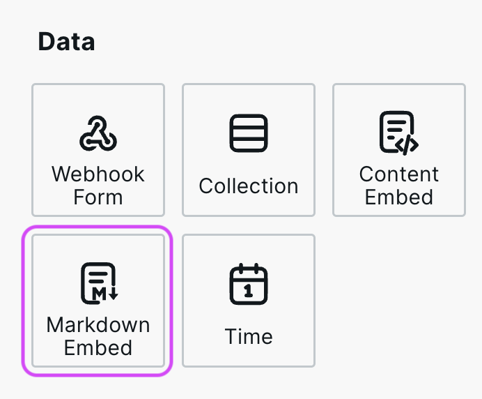
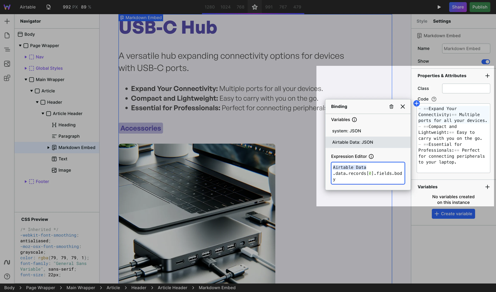
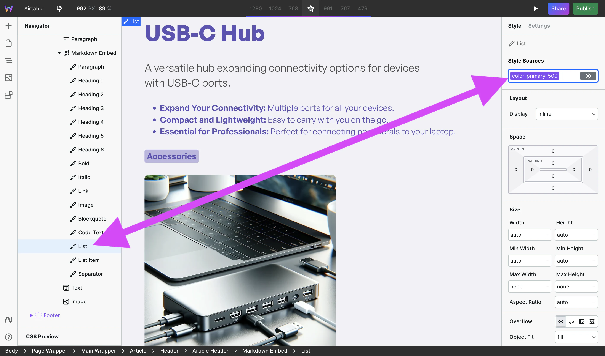

# 🪜 Markdown Embed

<div align="left">

<figure><figcaption></figcaption></figure>

</div>

## Why Markdown Embed is needed

Some APIs (or users) provide rich text in Markdown format, which can't be rendered in the web browser. Markdown Embed converts Markdown to HTML and enables applying styles to the various tags contained within HTML.

## How to use Markdown Embed

Markdown Embed is located in Components > Data.

### 1. Add Markdown

Once added to the canvas, the right panel will show a Code field. You can either add Markdown directly to it or, more commonly, bind Markdown to it from a Resource.

<figure><figcaption><p>CMS data bound to Markdown Embed Code</p></figcaption></figure>

### 2. Style

In the Navigator, Markdown Embed has various HTML tags nested. Expand Markdown Embed, and you’ll see tags such as Heading 1, Link, Image, and much more.

<figure><figcaption><p>List selected and styled</p></figcaption></figure>

Styles applied to each of these tags will apply to all occurrences of that tag within the Markdown Embed. For example, if you apply a border on the Image tag, then all images contained within the HTML will have a border.

## GitHub-style alerts

Use GitHub-style alerts to call attention to notes, tips, important information, warnings, and cautions:

```markdown
> [!NOTE]
> Add helpful context here.

> [!WARNING]
> Explain what readers should be careful about.
```

Write the alert type in uppercase at the start of a blockquote. Markdown Embed supports `NOTE`, `TIP`, `IMPORTANT`, `WARNING`, and `CAUTION`. You can use links, lists, code, and other Markdown inside an alert.

Select **Alert** to style every alert, **Alert title** to style the visible type label, or a type-specific descendant such as **Warning alert** to style one alert type. Markdown Embed renders the same markup and variants as the standalone [Alert component](alert.md).

## Image handling

Webstudio optimizes images contained in Markdown with the same responsive image pipeline as the [Image component](image.md#optimize). It generates the appropriate `srcset` and `sizes` attributes and lazy-loads images by default.

Data URL images are served as-is without optimization.

## Similar components


[html-embed.md](html-embed.md)



[content-embed.md](content-embed.md)


## Related

- [Content Embed](content-embed.md) – Render rich text/HTML
- [Alert](alert.md) – Add and style standalone callouts
- [HTML Embed](html-embed.md) – Custom HTML code
- [Collection](collection.md) – Loop through CMS data
