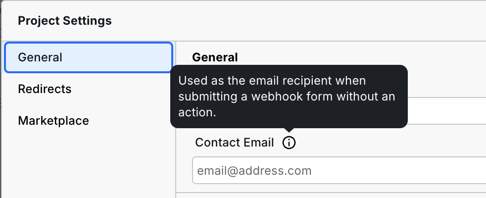
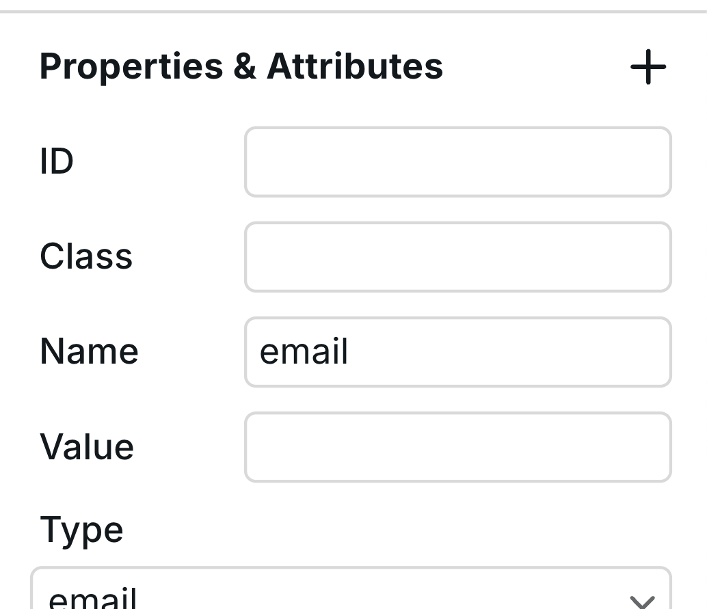

# ✍️ Webhook Form


**Name change:** Webhook Forms used to be called "Forms." However, [Forms](form.md) are now a different component intended for building searches and filters.




## Receiving Form Submissions

Webhook Forms are used when you need to send form submission data to an external service, rather than modifying page content like searches and filters.

### Email Notifications

By default, submissions are sent to the Project owner.


**Pro feature:** You can customize the recipient of email notifications by navigating to **Project settings > General**.



### Webhooks

You can also send form submission data to a webhook—an external URL that receives the data and triggers an action, such as adding a contact to an email automation platform.

1. Obtain a webhook URL from a third-party platform such as [Airtable](../integrations/airtable-form-webhook.md).
2. Paste the URL into the `Action` field in **Webhook Form > Settings**.

Once set up, every form submission will send a payload (form fields and values) to the webhook URL.

### Multiple actions

A form can send the same submission to several services and also send an email notification.

1. Create a [Resource variable](../foundations/variables.md) for each service. Configure its URL, method, headers, and any query parameters in the variable editor.
2. Select the Webhook Form, open **Settings**, and select a Resource in **Action source**.
3. Choose **Multiple actions**, then use **Add Resource** to select more existing Resources. Each Resource can be selected once.
4. Enable **Send email** to also notify the recipients in **Project settings > General > Contact email**. Separate multiple recipients with commas; your plan's recipient limit applies. Without a custom recipient, email goes to the project owner.
5. Publish and submit the form to test every destination.

Use the gear beside a selected Resource to open its full variable editor. Changes apply everywhere that Resource is used. Removing an action from the form keeps its Resource variable available.

Independent actions run at the same time. A Resource that depends on another Resource waits for it, and shared dependencies load once per submission. Each action receives the form fields as its body, replacing its configured body. Multipart submissions send the same files and repeated fields to every selected webhook. GET requests do not send a body.

The form shows success only after every action succeeds. Failed dependencies prevent their dependent actions from being sent; independent actions still finish. Each request has a 30-second timeout. A timeout does not prove that the receiving service rejected the submission.

If some actions succeed and others fail, the form shows an error with retry guidance. Webstudio does not retry automatically or undo successful deliveries. Submitting again sends all actions again and may create duplicates. Use a receiving service's deduplication feature when duplicates would be harmful.

Built-in email requires Webstudio hosting or a configured email adapter in your own server deployment. Selecting email on a deployment without that adapter fails the submission before webhooks are sent. Static exports cannot run these server actions.

### File uploads and repeated fields

Use `multipart/form-data` when your webhook needs files or several values with the same field name. The receiving service must support multipart requests. Other submissions use JSON by default.

1. Select **Webhook Form** and open **Settings**.
2. Set **Action** to your webhook URL.
3. Under **Properties & attributes**, add `enctype` and choose `multipart/form-data`.
4. Add an [Input](input.md) inside **Form Content**. Set its **Type** to `file` and give it a **Name**, such as `attachments`.
5. To allow several files, add the `multiple` attribute to the Input and enable it.
6. Publish the site and submit the form with a file selected.

The webhook receives each file with its filename, media type, and contents. Uploads go to the configured webhook; default email notifications do not provide file attachments.

For a group of checkboxes, give each checkbox the same **Name** and a different **Value**. Multipart submissions keep every checked value as a separate field with that name. You do not need to add `[]` to the name.

## Using the Webhook Form Component

You can add a Webhook Form Component to your canvas from **Components Panel > Data section**.


Webhook Forms do not submit inside the Builder, including in Preview. They only submit on the published site.


### Webhook Form Structure

A Webhook Form consists of three nested instances:

1. **Form Content** – The primary form fields.
2. **Success Message** – Displayed upon successful submission.
3. **Error Message** – Shown when an error occurs.

You can [add new Components](form.md#form-inputs) to further expand and modify your form.

### Form States

Webhook Forms automatically switch between states based on submission results.

#### Success Message

When a submission is successful, users will see a success message. To customize it:

1. Select the main "Form" instance and go to **Settings**.
2. Change the **State** from "Initial" to "Success."
3. Edit the success message directly on the canvas.

#### Error Message

If there’s an error during submission, users will see an error message. To modify it:

1. Select the Webhook Form Component.
2. Set the **State** to "Error" to preview and edit the error message.

## Form Inputs


Each input field must have a `name` attribute for its data to appear in email notifications and webhook payloads.


Ensure every form input has a value for the `name` field to be included in submissions.

<figure><figcaption></figcaption></figure>

For a full list of input types, including checkboxes and radio buttons, refer to [Form Inputs](form.md#form-inputs).

### Input Properties

Each input field has several configurable properties in Settings:

- **Name**: The field identifier used in submissions (required for data to appear)
- **Type**: Define the input type (text, email, tel, etc.). Setting type to "email" enforces email format validation.
- **Placeholder**: Hint text shown inside the input before user enters data (e.g., "john@doe.com")
- **Required**: When enabled, the form cannot be submitted without this field
- **Autofocus**: When enabled, this field is automatically focused when the page loads

### Styling Form States

You can create interactive form styling using states in the Style panel:

- **Hover**: Apply styles when users hover over an input (e.g., wider border, box shadow)
- **Focus**: Apply styles when an input is active/selected (e.g., colored border, glow effect)
- **Placeholder**: Style the placeholder text appearance

To apply state-specific styles, select the input element, open the state dropdown in the Style panel, and choose the state you want to customize.

## Bot Protection

Webstudio forms include built-in bot protection to prevent spam submissions. This protection works automatically without requiring any additional configuration – no CAPTCHAs needed. The system analyzes submission patterns to distinguish between legitimate users and automated bots.

## Related

- [Form](form.md) – Standard HTML forms
- [Input](input.md) – Text input fields
- [Button](button.md) – Submit buttons
- [n8n Integration](../integrations/n8n.md) – Automate form workflows
- [Zapier Integration](../integrations/zapier.md) – Connect to other apps
