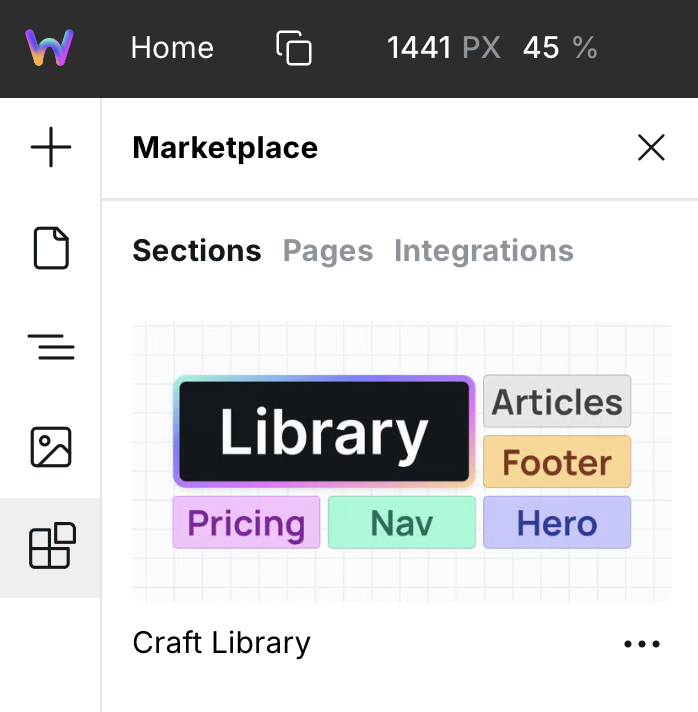

# Craft

Craft is the universal standard for building maintainable, reusable, and
portable projects with Webstudio. It defines how to name and use CSS variables,
Tokens, and Local styles so that people and shared Marketplace resources can
work together without introducing incompatible conventions.

Craft is recommended, but not mandatory. A project can extend Craft for its
domain without turning those extensions into requirements for every Craft
project.


Contribute changes to Craft by commenting on this [GitHub Discussion](https://wstd.us/discuss-craft).




## Specification language

Craft uses the following terms to distinguish requirements from guidance:

- **Must** identifies a requirement for Craft conformance.
- **Should** identifies a recommendation that may be ignored when a project
  has a documented reason.
- **May** identifies an optional feature or extension.

## Architecture

Craft has three layers:

```text
Theme variables
      ↓
Semantic variables
      ↓
Composite Tokens
```

### Theme variables

Theme variables contain the values that make one theme different from another.
They may contain literal values or reference palette variables such as those
provided by Open Props.

Craft does not require every project to use the same number of theme variables.
A project must document its theme variables when it publishes reusable
resources or a theme for other projects.

### Semantic variables

Semantic variables describe why a value is used rather than what the value
looks like. For example, use `--foreground-negative` for an error message
instead of consuming a red palette value directly.

Semantic variables must reference theme variables or other semantic variables.
They should not contain standalone literal design values.

### Composite tokens

A Webstudio Token packages multiple style declarations. Craft calls these
**composite Tokens** to distinguish them from individual values stored in CSS
variables.

Composite Tokens must consume semantic variables when a suitable variable
exists. They should not consume palette or theme variables directly.

Components, utilities, variants, and sizes are purposes of composite Tokens,
not additional layers in the architecture.

### Local styles

Use **Local** for values and declarations that belong to one instance. Move a
decision into a CSS variable or composite Token when it becomes reusable.

## CSS variables

Craft projects may use [Open Props](https://open-props.style/), an MIT-licensed
collection of CSS variables, for palettes and scales. Open Props variables are
optional theme inputs and utilities; they are not replacements for Craft
semantic variables.

Define variables that are shared across a project on **Global Root**. Define a
variable on a closer common ancestor when its meaning is intentionally local to
one page, section, or component subtree.

### Naming variables

CSS variable names must:

- Use kebab-case.
- Use complete words unless an abbreviation is part of the approved Craft
  vocabulary.
- Describe purpose rather than visual appearance at the semantic layer.
- Follow `category-role-state` when all three segments are needed.
- Omit segments that do not add meaning.

Examples:

```css
--foreground-primary
--background-accent-hover
--border-negative
--overlay-scrim
```

Palette and scale variables use numbers:

```css
--blue-10
--size-4
```

Do not encode a literal value in a semantic name:

```css
/* Avoid */
--foreground-gray
--background-blue-hover

/* Prefer */
--foreground-muted
--background-accent-hover
```

## Semantic colors

Craft organizes interface colors into four categories:

- **Foreground** for text, icons, and other marks drawn over a background.
- **Background** for canvases, surfaces, controls, and filled states.
- **Border** for boundaries, separators, and focus indicators.
- **Overlay** for translucent interaction layers and scrims.

The core vocabulary is:

```text
Emphasis: primary, secondary, muted, disabled, inverse
Intent: accent, positive, negative, warning, informative
State: hover, pressed, selected, disabled, focus
```

Not every combination needs a variable. Add a state suffix only when that state
has a reusable value distinct from its base role.

### Core color variables

Craft projects must provide the variables they consume from this core. Shared
Marketplace resources must declare which variables they require and must not
silently depend on an undocumented project-specific variable.

```css
/* Foreground */
--foreground-primary
--foreground-secondary
--foreground-muted
--foreground-disabled
--foreground-inverse
--foreground-accent
--foreground-positive
--foreground-negative
--foreground-warning
--foreground-informative

/* Background */
--background-primary
--background-secondary
--background-disabled
--background-inverse
--background-accent
--background-positive
--background-negative
--background-warning
--background-informative

/* Border */
--border-default
--border-strong
--border-focus
--border-accent
--border-positive
--border-negative
--border-warning
--border-informative

/* Overlay */
--overlay-subtle
--overlay-pressed
--overlay-scrim
```

Add reusable state variables using the same grammar:

```css
--background-secondary-hover
--background-secondary-pressed
--background-accent-hover
--background-accent-pressed
--background-accent-selected
--background-negative-hover
```

Component states map to the semantic state that describes their visual meaning.
For example, `checked`, `on`, and `current` commonly use a selected color;
`invalid` commonly uses negative colors. A component state does not require a
new global color variable when an existing semantic state expresses the same
meaning.

### Deriving colors

Semantic colors should remain connected to the theme. Prefer aliases and
relative color expressions over duplicated literals:

```css
:root {
  --theme-canvas: oklch(98% 0.01 250);
  --theme-foreground: oklch(20% 0.02 250);
  --theme-accent: oklch(55% 0.2 255);

  --background-primary: var(--theme-canvas);
  --foreground-primary: var(--theme-foreground);
  --background-accent: var(--theme-accent);
  --background-accent-hover: color-mix(
    in oklch,
    var(--theme-accent) 88%,
    var(--theme-foreground)
  );
}
```

The example names do not prescribe a fixed number of theme variables. They
demonstrate the required separation between theme inputs and semantic outputs.

### Other core variables

Craft retains a small vocabulary for reusable layout, focus, and motion values:

```css
--gap-xs
--gap-s
--gap-m
--gap-l
--spacing-default

--focus-width
--focus-offset

--duration-default
--easing-default
```

These variables follow the same architecture: their semantic values should
derive from documented theme or scale inputs where appropriate.

## Interaction states

Use these semantic states consistently:

| State      | Meaning                                                        |
| ---------- | -------------------------------------------------------------- |
| `hover`    | A pointing device is over an interactive target.               |
| `pressed`  | A target is being activated. CSS `:active` maps to `pressed`.  |
| `selected` | An option or item is chosen, current, checked, or switched on. |
| `disabled` | An interaction is unavailable.                                 |
| `focus`    | A target has visible keyboard focus.                           |

States such as `open`, `pending`, `invalid`, and application-specific statuses
may affect several properties. Express them with composite Token variants and
reuse the closest semantic colors rather than automatically creating a global
color for each state name.

## Accessibility

Themes and extensions must preserve accessible semantic pairings.

- Normal text must have a contrast ratio of at least 4.5:1 against its
  background.
- Large text must have a contrast ratio of at least 3:1 against its background.
- Meaningful non-text interface graphics must have a contrast ratio of at least
  3:1 against adjacent colors.
- Keyboard focus must remain visible. A custom focus indicator should provide
  at least a 3:1 change of contrast and an area at least equivalent to a 2 CSS
  pixel perimeter.
- Color must not be the only way to communicate status or state.
- Disabled styling may be subtle, but must not obscure information required to
  understand the interface.
- Every supported theme must satisfy the same requirements.

See [WCAG 2.2 contrast requirements](https://www.w3.org/TR/WCAG22/#contrast-minimum)
and [focus appearance guidance](https://www.w3.org/WAI/WCAG22/Understanding/focus-appearance.html).

## Composite tokens

Composite Tokens combine reusable declarations. Their values should reference
CSS variables so a theme can change without editing the Token.

| Purpose   | Naming             | Examples                        |
| --------- | ------------------ | ------------------------------- |
| Utility   | Kebab-case         | `margin-auto`, `flex-gap-small` |
| Component | Kebab-case         | `button`, `input`, `card`       |
| Semantic  | Title case         | `Pricing Card`, `Team Member`   |
| Variant   | `is-{base}-{name}` | `is-button-secondary`           |
| Size      | `{base}-{size}`    | `button-small`, `button-large`  |

A variant must be used with its base Token. A size Token should contain only
the declarations needed to change size.

Prefer a composite Token when a reusable decision needs multiple declarations
or coordinated states. Prefer a CSS variable for one reusable value. Use Local
for an instance-specific exception.

When multiple Tokens set the same property, the rightmost style source wins.
Place Local last when an instance needs to override a Token.

## Extensions and exceptions

A project may extend Craft when the core vocabulary cannot express a reusable
domain concept.

An extension must:

1. Follow the same naming grammar.
2. Describe purpose rather than a specific visual value.
3. Reuse or derive from existing theme and semantic variables when possible.
4. Introduce a new theme value only when an existing value cannot preserve the
   intended distinction.
5. Document its meaning, supported states, accessibility pairings, and theme
   behavior when it is shared outside the project.

Literal colors are appropriate when the color belongs to user content, an
external representation, data visualization, or a functional preview that
must not change with the interface theme. Document shared exceptions so they
are not mistaken for missing semantic variables.

Project-specific extensions do not become Craft core automatically. Promote an
extension only when the same semantic need is reusable across unrelated
projects.

## Conformance

A project conforms to Craft when:

- Shared composite Tokens use semantic variables where suitable.
- Semantic variables derive from documented theme or semantic variables.
- Theme changes do not require editing composite Tokens.
- Variable and Token names follow the Craft grammar.
- Required foreground and background pairings meet the accessibility rules.
- Shared extensions and literal exceptions are documented.
- Reusable resources declare their required Craft variables and extensions.

Conformance does not require every project to define every variable in the
reference list. It requires every consumed variable and extension to follow the
contract.

## Getting started

1. Go to **Marketplace → Pages → Craft**.
2. Insert the **Style Guide** page.
3. Customize the theme or palette variables on **Global Root**.
4. Map Craft semantic variables to the theme.
5. Build with semantic variables and composite Tokens.
6. Document project extensions in the Style Guide.

## Page template workflow

The Craft Style Guide includes a page template with navigation, a main region,
sections, containers, and a footer:

1. Copy the template structure when creating a page.
2. Duplicate the template section and name it for its content, such as `Hero`.
3. Design the section using Craft variables and Tokens.
4. Duplicate the clean template section for the next section.

## Internal Style Guide

Use `Style Guide` as the page name. Prefix Tokens used only to present the
Style Guide with two underscores, such as `__badge` or `__outline`. Do not use
these presentation Tokens on the published site.

## Navigator

Use title case and semantic labels in the Navigator.

- Give Box, Slot, HTML Embed, and Collection instances names that describe
  their purpose.
- Name containers after their content rather than position or appearance.
- Use a plural parent and singular children for repeated content, such as
  `Cards` containing several `Card` items.
- Prefix a Box using the `section` element with `Section`, such as
  `Section Hero`.
- Keep one HTML Embed instance responsible for one purpose, and begin its code
  with a comment describing that purpose.

Recommended page structure:

```text
Page Wrapper
├── Slot
│   ├── Global Styles
│   └── Nav
├── Main
│   └── Section
│       └── Container
└── Slot
    └── Footer
```

## Craft Library

Craft Library is a collection of section templates built to Craft standards
and available in the [Marketplace](marketplace.md).

Templates must avoid unexplained hardcoded design values. They must consume
documented Craft variables or documented extensions so that a section adapts
when inserted into another conforming project.

<figure><figcaption><p>Craft Library in the Marketplace</p></figcaption></figure>



## Changelog

### Next

- Defined the Craft architecture, naming grammar, color semantics,
  accessibility requirements, extension rules, and conformance criteria.
- Defined Webstudio Tokens as composite Tokens and aligned component, utility,
  semantic, variant, and size naming.
- Replaced `--foreground-border` with the correctly categorized
  `--border-default` variable.
- Replaced the color variable `--focus-color` with `--border-focus`. Existing
  projects may keep `--focus-color` as a temporary alias while migrating.

### 1.2

- Changed `container` to use flex for compatibility with Craft Library. Set
  `display` to `flex`, `flex-direction` to `column`, and `gap` to
  `var(--gap-m)`. Apply horizontal layout changes on Local where needed.

### 1.1

- Added `--spacing-default` for shared container and card padding.

### 1.0

- Released Craft.

## Related

- [Design tokens](foundations/design-tokens.md) – Create and manage reusable composite Tokens
- [CSS variables](foundations/css-variables.md) – Define and scope reusable values
- [States and selectors](foundations/states-and-selectors.md) – Style interaction states
- [Anatomy of the Webstudio builder](foundations/anatomy-of-the-webstudio-builder.md) – Understand the Builder interface
- [Marketplace](marketplace.md) – Access Craft Library and other resources
- [Contributing to the Marketplace](../contributing/marketplace.md) – Submit Craft resources
