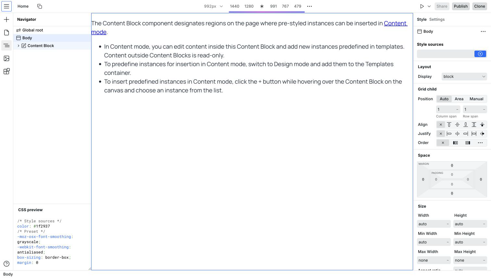
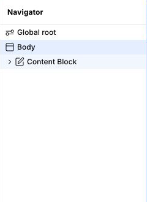
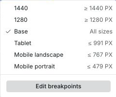
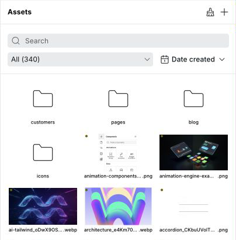
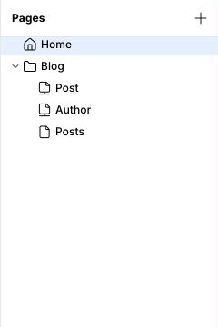
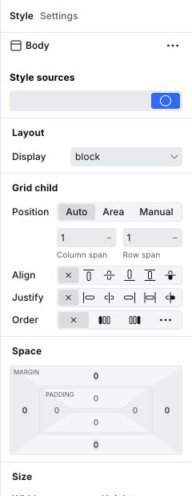
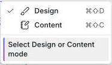
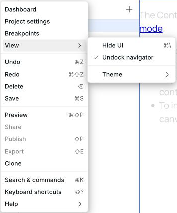

# 🛠️ Anatomy of the Webstudio builder


Webstudio 101 Playlist


<picture>
  <source media="(prefers-color-scheme: dark)" srcset="../../.gitbook/assets/builder-overview-dark.png">
  
</picture>

## Canvas

The canvas provides a visual representation of the website you are creating. After adding components from the Components panel, you can arrange and style their instances on the canvas.

## Navigator

The Navigator Panel is a hierarchical overview of all instances on your page. It displays the website’s structure, showing the nesting and relationships between different instances. You can select the instance of any component inside your Project by clicking it on the canvas or inside the navigator.

### Rename instances

Double-click any instance in the Navigator to rename it. Use semantic names like "Hero Section" or "Contact Form" to make your project structure easier to understand and maintain.
In the bottom half of the navigator, you will find the CSS Preview section, which is a real-time preview of the CSS styles applied to your selected instance.

<picture>
  <source media="(prefers-color-scheme: dark)" srcset="../../.gitbook/assets/navigator-panel-dark.png">
  
</picture>

### Global root

In the Navigator is the Global Root, the highest level of the page. Changes made to it apply to every page. It’s useful for setting global styles, such as font size and line height, and defining [CSS variables](css-variables.md) so they are accessible on every instance on every page. Changing the font size on the root affects all CSS properties that use REM, as this unit is relative to the root font size. For example, `1rem` outputs as `1 x root font size`.


Global Root uses the`:root` [CSS selector](https://developer.mozilla.org/en-US/docs/Web/CSS/:root) under the hood.


<picture>
  <source media="(prefers-color-scheme: dark)" srcset="../../.gitbook/assets/navigator-panel-dark.png">
  
</picture>

## Breakpoints

Breakpoints are crucial for creating responsive websites that adapt to different screen sizes and devices. _Style_ changes you make on one breakpoint cascade, or affect, that breakpoint and all the smaller ones.


You can create custom breakpoints with any media query condition – not just width-based. This includes `prefers-color-scheme` for dark mode, `prefers-reduced-motion` for accessibility, `orientation`, and more.



Adding too many breakpoints or mixing and matching `min-width` and `max-width` will make maintenance difficult. The default breakpoints suffice more in the majority of use cases.


<picture>
  <source media="(prefers-color-scheme: dark)" srcset="../../.gitbook/assets/breakpoints-dark.png">
  
</picture>

By defining how components should behave at different screen sizes, you can ensure your website looks great on various devices, including desktops, tablets, and smartphones.


When you select a breakpoint, such as 991, you’ll notice that the canvas is sized to 768. This is intentional. The goal is to style for the minimum (or maximum, if using min-width) to ensure all design issues are addressed at the "extreme" end of that breakpoint. When the viewport changes to 767, the next breakpoint is triggered.


## Components panel

The Components Panel contains a list of all available [components](../core-components/) that you can add to your Webstudio Project. You can do this by clicking the components in the panel or dragging and dropping them on the canvas.

Components are grouped into sections like General, Text, Media, Forms, and [Radix](../radix/). For example, the Text section has all typography-related components, while the Form section nests the building blocks of a form.&#x20;

<picture>
  <source media="(prefers-color-scheme: dark)" srcset="../../.gitbook/assets/components-panel-dark.png">
  
</picture>

## Assets panel

The Assets Panel is the second panel to the left of your canvas, and this is where all the static files are stored. You can upload, organize, and manage project assets inside this panel before using them on the canvas.

<picture>
  <source media="(prefers-color-scheme: dark)" srcset="../../.gitbook/assets/assets-panel-dark.png">
  
</picture>

### Asset types

The Assets Panel supports various file types organized by category:

- **Images** – JPEG, PNG, GIF, WebP, SVG, ICO, and more
- **Fonts** – WOFF, WOFF2, TTF, OTF, and more
- **Documents** – PDF, JSON, XML, and more
- **Other** – Various additional file formats

This list is not exhaustive – Webstudio supports many additional file formats.

### Filter and sort

Use the filter dropdown to show only specific asset categories (Images, Fonts, Documents, or All). Assets can be sorted by:

- **Name** – Alphabetically A-Z or Z-A
- **Date** – Newest or oldest first
- **Size** – Largest or smallest first

### Asset details

Click on any asset to view its details panel, which shows:

- **Name** – Click to rename the asset
- **Description** – Add optional description text for organization
- **Dimensions** – Width and height for images
- **File size** – Size of the asset file
- **Uses** – Number of places the asset is used in your project

### Asset actions

- **Download** – Download the original asset file to your computer (Pro plan required)
- **Review & Delete** – When an asset is in use, shows where it's used before confirming deletion. Unused assets can be deleted directly.
- **Delete unused assets** – Click the brush icon in the Assets Panel header to
  review unused assets. All assets are selected by default; uncheck any you want
  to keep or use **Select all** to change the complete selection. Confirming
  deletes only selected assets. This command is also available from the
  [Command Panel](commands-and-search.md).


Assets that are currently used in your project will show a settings gear icon. Attempting to delete them will display a list of all usages so you can review before confirming.


## Pages panel

The Pages Panel offers an overview of the website’s page structure and hierarchy, and it is the last panel on the left side of your canvas, under the Components and Assets Panels.

You can use this panel to add new pages to your Webstudio site, set the homepage, rename existing ones, and configure fields for social sharing and search engines.

<picture>
  <source media="(prefers-color-scheme: dark)" srcset="../../.gitbook/assets/pages-panel-dark.png">
  
</picture>

### Page folders

Organize your pages into collapsible folders for better project management. Right-click in the Pages Panel to create a new folder, then drag pages into it. Folders help keep large projects organized and make navigation easier.

## Style panel

The Style Panel is located to the right of the canvas, and you can use it to customize the appearance and layout of a selected instance. It offers access to all CSS properties, visually.

<picture>
  <source media="(prefers-color-scheme: dark)" srcset="../../.gitbook/assets/style-panel-dark.png">
  
</picture>

There are three methods for adding styles:

1.  Local - By default, the Local icon is active, meaning any styles you apply to that instance are for that instance only. The dot in the middle of the Local icon indicates that it has styles, whereas no dot indicates that there are no styles applied, making it easy to identify which ones have styles applied.

2.  [CSS variables](css-variables.md) - Instead of pasting in your colors, sizes, and other styles, you can create a variable for each style and access the variables in each input field. For example, you can define a variable called "color-primary," and in your border color field, you can enter the variable name instead of the color itself.
3.  [Tokens](design-tokens.md) - These enable reusing groupings of styles across your site. You can either create a new Token and apply styles to it or start with Local and convert it to a Token. Tokens are typically comprised of CSS variables and one-off styles.

### Label colors

The style input labels change colors indicating there is a style present.

| Label color                                                           | What it means                                                                                                                                                                                                       |
| --------------------------------------------------------------------- | ------------------------------------------------------------------------------------------------------------------------------------------------------------------------------------------------------------------- |
| <mark style="background-color:blue;">**Blue**</mark>                  | This style is on the current Token.                                                                                                                                                                                 |
| <mark style="color:orange;background-color:orange;">**Orange**</mark> | This style is coming from another source: a Token that is not selected, a state not selected (e.g., you're on hover but the style is local), inherited from a parent instance, or cascaded from another breakpoint. |
| <mark style="background-color:yellow;">**Gray**</mark>                | This is a Webstudio or browser default style (like font-family: arial).                                                                                                                                             |
| <mark style="color:red;background-color:red;">**Red**</mark>          | This style is on the current Style Source, but it’s being overwritten by something else in the Style Source input, such as Local or another Token.                                                                  |


The order of tokens in the Style Source Input matters. When multiple Tokens have a value for the same property, Tokens toward the end of the list will overwrite Tokens toward the beginning of the list.


## Settings panel

The Settings Panel is on the right side of your canvas. You can use this panel to access and edit component-specific properties (such as ID or class) and [Data variables](variables.md) for a selected instance, enabling you to store reusable content and fetch APIs — a building block of [CMS](cms.md).

---

## Modes

[Modes](modes.md) change the Builder's behavior, such as previewing your site without distractions.

<picture>
  <source media="(prefers-color-scheme: dark)" srcset="../../.gitbook/assets/builder-modes-dark.png">
  
</picture>

## Interface theme

Choose **Menu > View > Theme**, then select **System**, **Light**, or **Dark**.
**System** follows your operating system setting. The same preference is
available from the [Dashboard](dashboard.md#interface-theme) profile menu and
applies to both interfaces.

The interface theme does not change the site on the canvas. To design and
preview a site color scheme, use a
[color-scheme breakpoint](breakpoints.md#example-dark-mode).

## Hide UI

Hide UI gives the canvas the full builder workspace by hiding the sidebars, footer, and top bar. It works in any mode, so you can keep using Design, Content, or Preview while the Builder chrome is hidden.

Use Hide UI when you want more canvas space while designing, editing content, or previewing a page. Move the pointer to the top edge to temporarily reveal the top bar.

You can enable Hide UI from **Menu > View > Hide UI** or with `⌘ + \` on Mac and `Ctrl + \` on Windows.

<picture>
  <source media="(prefers-color-scheme: dark)" srcset="../../.gitbook/assets/builder-hide-ui-menu-dark.png">
  
</picture>

## Share dialog

The [Share Dialog](share-links.md) allows you to create shareable personal links to your Project with varying permissions.

---

## Publish dialog

The [Publish Dialog](publishing-and-custom-domains.md) enables you to add a custom domain, publish to Staging and/or your custom domain, and [export your Project](../self-hosting/).

Publishing builds and deploys the current Project. Keep the Publish dialog open to follow its status and review any reported errors.

## Related

- [Shortcuts](shortcuts.md) – Keyboard shortcuts to speed up building
- [Commands & search](commands-and-search.md) – Navigate and perform actions quickly
- [Design tokens](design-tokens.md) – Create reusable style packages
- [CSS variables](css-variables.md) – Define and reuse style values
- [Modes](modes.md) – Switch between Design, Content, and Preview modes
