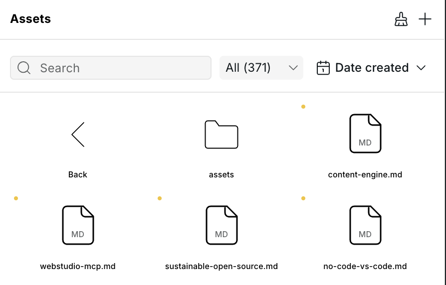
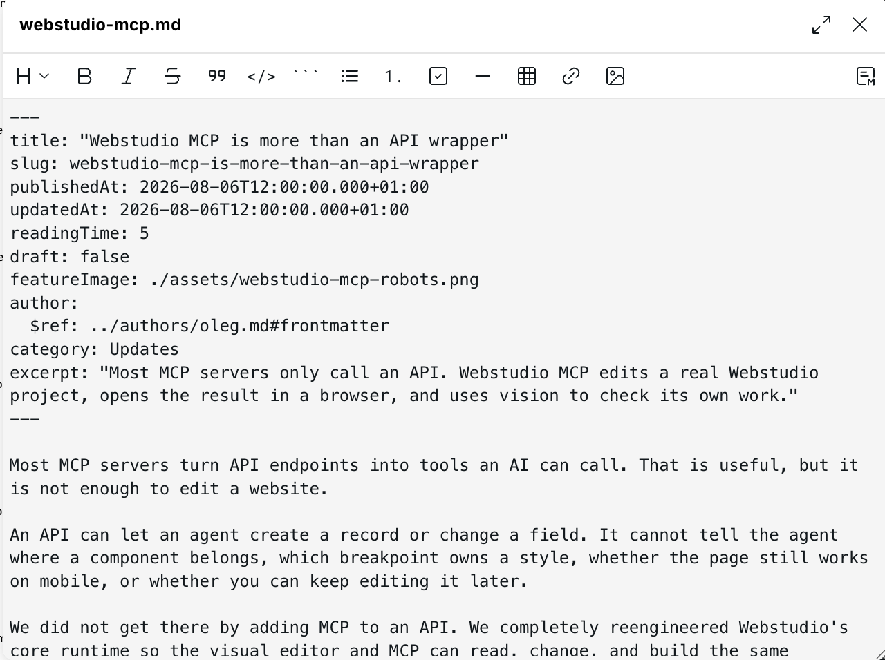
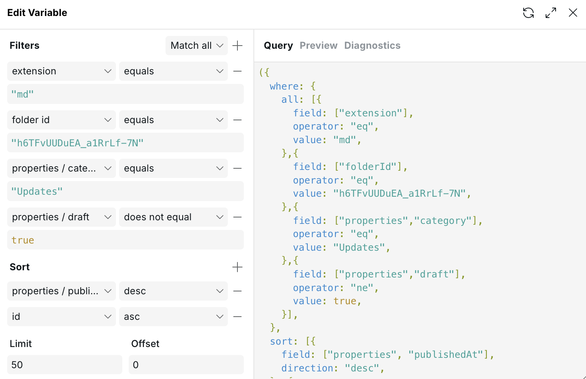
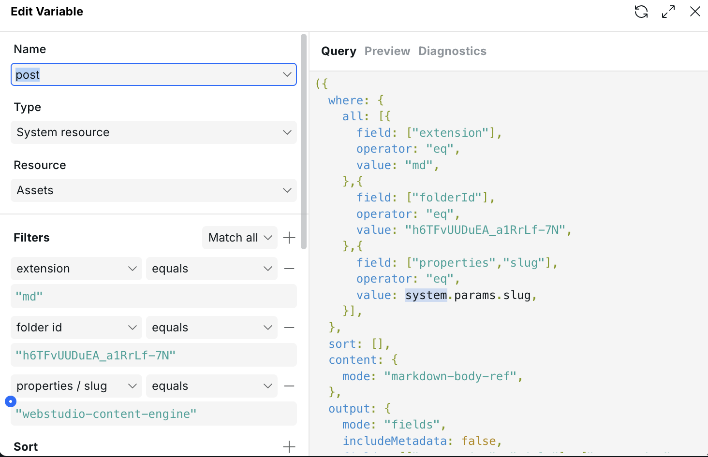

# 📚 Content Engine

Webstudio's Content Engine turns Markdown, MDX, and JSON files in Assets into content
you can query and bind in the visual editor. The files remain the source of
truth, including their filenames, folders, metadata, and relative links. You
can move the same files between projects or use them outside Webstudio without
exporting them from a database first.

This guide creates a blog overview at `/blog` and one dynamic article page at
`/blog/:slug`.

To see the finished setup first, start with the
[Markdown Blog marketplace template](https://webstudio.is/marketplace/templates/markdown-blog).

<figure><figcaption><p>Markdown articles stored alongside their assets</p></figcaption></figure>

## Decide if the Content Engine fits

Use the Content Engine for bounded, file-based content that should live with
the site and remain portable as Markdown, MDX, or JSON.

Good fits include:

- Small blogs with text and images.
- Portfolios, team directories, resource libraries, and case studies.
- Small product catalogues with infrequently changed display data. Keep orders,
  inventory, and payments in an ecommerce system.

Use an external CMS, commerce backend, or media service when you need:

- Several thousand entries or complex search and filtering.
- Large image or video galleries, media processing, or streaming.
- Live inventory, customer-specific prices, editorial workflows, scheduled
  publishing, or content shared across many applications.

### Limits that affect this choice

Queries can consider and return at most 1,000 documents. All reachable Assets
resources share a 500 KiB published content database. **Markdown body
reference** keeps article bodies out of the database.

Images and videos remain separate Assets, but the Content Engine does not
provide media processing or streaming. Review the complete
[query and content limits](content-engine-reference.md#query-limits) before
using it for a content-heavy project.

## Build it with MCP

An AI agent can complete this entire workflow through
[Webstudio MCP](../mcp.md). It can create the folders and Markdown files, upload
images, build both pages, configure the Assets resources, add the Collection,
bind the article directly, set the page metadata, and check the rendered result
with vision. Everything remains editable in the visual editor.

Give the agent an editable project share link when it asks for one, then make a
request such as:

> Use Webstudio CLI to build a blog with the Content Engine. Store the articles
> as Markdown files, create `/blog` and `/blog/:slug`, exclude drafts, and check
> both pages on desktop and mobile.

The remaining steps explain the same workflow when you want to build or inspect
it manually.

## 1. Organize the files

The Content Engine does not require a particular folder structure. This guide
uses the following organization in the Assets panel:

```text
blog/
  posts/
    assets/
```

Keeping all articles in one folder makes them easy to query. Images can live
next to the articles or in a nested folder.

Open the settings for the `posts` folder and copy its ID. Both Assets resources
in this guide use that ID to query only files in this folder.

### Make the folder a content collection

Turn on **Use as content collection** when you create the `posts` folder if
editors should be able to add articles without writing MDX frontmatter. This
creates two files in the folder:

- `collection.json` defines the entry fields and their rules with JSON Schema.
- `template.mdx` supplies the starting frontmatter and body for each entry.

The folder remains a normal Assets folder. The direct `collection.json` file is
what makes Webstudio treat it as a collection and show the collection badge.
Open **Collection settings** to add fields, choose their types, mark them as
required, and set text-length or number limits. The configurator writes the
schema; designers do not need to edit JSON.

Editors choose **New entry**, complete the generated form, and select **Create
entry**. Webstudio creates a lowercase, dash-separated slug from the title.
Editors can change the slug before creating the entry. The schema is checked
when an entry is created and whenever its frontmatter changes.

A collection folder accepts entries and subfolders. Uploading, creating a
generic text file, pasting, moving, or duplicating another file directly into
the collection is disabled. Put images and other supporting files in a
subfolder. The collection configuration and template do not appear in Content
Engine query results.

Removing the collection in **Collection settings** deletes only
`collection.json`. The folder becomes a normal folder again, while its entries
and template remain.

## 2. Create an article

If `posts` is a content collection, choose **New entry** and fill in its form.
Otherwise, create the file and frontmatter manually:

1. Open `blog/posts` in the Assets panel.
2. Open the add menu and choose **Create text file**.
3. Name the file `hello-world.md`.
4. Add the article metadata between the two `---` lines, followed by the
   article body:

```markdown
---
title: Hello world
slug: hello-world
publishedAt: 2026-08-10
excerpt: A short introduction to the article.
draft: false
featureImage:
  $ref: ./assets/hello-world.png
author: Ada Lovelace
---

# Hello world

Write the article here.
```

<figure><figcaption><p>An article's metadata and body in the Markdown editor</p></figcaption></figure>


### Frontmatter

The opening YAML block is called **frontmatter**. It must be the first block in
the Markdown file and must start and end with `---` on separate lines.

Frontmatter accepts strings, numbers, booleans, `null`, arrays, and nested
objects. The Content Engine exposes these fields under `properties`, such as
`properties.title` and `properties.slug`.

You define the fields yourself. Keep their names and value types consistent
between articles so one query and one page design work for every article.


`draft` is a field you defined, not the visual editor's automatic
[page draft](page-settings.md#draft-pages) setting. Add a query filter that
excludes `draft: true` anywhere unpublished articles must not appear.


The Markdown below the closing `---` is the body. It is available separately
at `content.text` when the Assets resource uses **Markdown body reference**.

### Relative asset paths

Upload `hello-world.png` to `blog/posts/assets`. The article's `$ref` resolves
relative to the Markdown file. It declares that `featureImage` is structured
asset data without deciding which metadata a query must return.

Relative paths also work in nested objects, arrays, and JSON files. Query
strings and fragments are preserved, so a value such as
`./assets/hello-world.png?width=1200#cover` remains usable.

Select only the referenced fields the page uses, such as
`properties.featureImage.src` and `properties.featureImage.description`. The
value becomes structured data:

```js
post.properties.featureImage.src
post.properties.featureImage.description
```

Bind the Image source to `post.properties.featureImage.src`. Bind its
alternative text to
`post.properties.featureImage.description ?? post.properties.title`. This
uses the Asset Manager description when present and falls back to the article
title. Existing content that stores the asset path as a plain string continues
returning a URL string.

Imported content can also use published asset paths such as
`./assets/hero.png` or `/assets/hero.png`. Webstudio matches the final filename
across project Asset folders, so the content file and referenced asset do not
need to share the same folder hierarchy. The filename must identify exactly
one project asset.

Webstudio resolves a path only when it uniquely matches a project asset.
External URLs, other root-relative URLs, missing paths, and ambiguous paths
remain unchanged. Keep the clean path in the source instead of hardcoding an
asset ID or generated filename. This is what makes the content portable.

### JSON files

The Content Engine can query JSON files as well as Markdown and MDX. JSON files can
contain objects, arrays, or scalar values. A root object exposes its fields for
structured queries:

```json
{
  "name": "Ada Lovelace",
  "role": "Author",
  "avatar": "./assets/ada.png"
}
```

The object's fields are exposed under `properties`, such as `properties.name`
and `properties.avatar`. Root arrays and scalars remain valid JSON content but
do not expose top-level `properties` fields. Use JSON when the file contains
structured data without a Markdown body. Name the file with a `.json` extension
in the **Create text file** dialog. A new file starts with an empty object, which
you can replace with any JSON value. The editor accepts JSON-compatible syntax
and formats it as strict JSON when saving. Unsupported or incomplete syntax is
reported without saving the file. You can also change an existing text file's
extension to `.json` by editing its complete filename in Asset settings;
Webstudio validates and formats the current content before converting it.

## 3. Query the articles for the overview

Create a static page with the path `/blog`, then add an Assets resource to its
page-level **Dynamic data**:

1. Create a **System Resource** and choose **Assets**.
2. Name it `posts`.
3. Under **Output**, choose **Selected fields**, turn off **File metadata**, and
   include only the fields the overview renders, such as `properties.title`,
   `properties.slug`, `properties.publishedAt`, `properties.excerpt`, and
   `properties.featureImage.src` and
   `properties.featureImage.description`.
4. Under **Result**, choose **Many**.
5. Under **Content**, choose **Metadata only**. The overview does not render
   complete article bodies.
6. Add these filters:
   - `extension` **equals** `"md"`
   - `folder id` **equals** the quoted `posts` folder ID
   - `properties.draft` **does not equal** `true`
7. Sort `properties.publishedAt` in descending order. Add `id` in ascending
   order as a second sort so articles with the same publication date keep a
   stable order.

<figure><figcaption><p>An overview query for the Webstudio Updates project</p></figcaption></figure>


Choosing only the fields the page renders keeps the published content data
small. Leaving article bodies out of the overview also avoids loading every
article just to display a list.

## 4. Build the overview

1. Add a [Collection](../core-components/collection.md) to the page.
2. Bind the Collection data to `posts.data`.
3. Rename the Collection Item to `Post`.
4. Design one article card inside the Collection.
5. Bind the card's text and image to fields on `Post.value`, such as
   `Post.value.properties.title` and
   `Post.value.properties.featureImage.src`.
6. Bind the image alternative text to
   `Post.value.properties.featureImage.description ?? Post.value.properties.title`.
7. Bind the card link to `"/blog/" + Post.value.properties.slug`.

The Assets resource returns many results as an object keyed by asset ID. The
current article inside the Collection is available through the Collection
Item's `value`.

## 5. Create the dynamic article page

Create one page with the path `/blog/:slug`. This page is the template for all
articles. In the visual editor's address bar, enter `hello-world` as the
preview value for `:slug`.

Add another Assets resource to the page-level **Dynamic data**:

1. Create a **System Resource** and choose **Assets**.
2. Name it `post`.
3. Under **Output**, choose **Selected fields**, turn off **File metadata**, and
   include the fields this page renders, such as `properties.title`,
   `properties.publishedAt`, `properties.excerpt`,
   `properties.featureImage.src`, `properties.featureImage.description`, and
   `properties.author`.
4. Under **Result**, choose **Exactly one**.
5. Under **Content**, choose **Markdown body reference**.
6. Add these filters:
   - `extension` **equals** `"md"`
   - `folder id` **equals** the quoted `posts` folder ID
   - `properties.slug` **equals** `system.params.slug`
   - `properties.draft` **does not equal** `true`

<figure><figcaption><p>The article Resource uses the dynamic slug from the page URL</p></figcaption></figure>


**Exactly one** returns the matching article directly at `post.data`. It also
reports an error if two articles use the same slug. You do not need a
Collection on the article page.

**Markdown body reference** keeps article bodies out of the published content
database. Webstudio first finds the matching article, then loads only that
Markdown body from Assets.

## 6. Bind the article

Bind the article components directly to `post.data`:

- Heading: `post.data.properties.title`
- Author: `post.data.properties.author`
- Image source: `post.data.properties.featureImage.src`
- Image alternative text:
  `post.data.properties.featureImage.description ?? post.data.properties.title`
- Markdown Embed code: `post.data.content.text`

Add a [Markdown Embed](../core-components/markdown-embed.md) for the body. Style
its nested headings, paragraphs, links, lists, and images once; the styles apply
to every article.

In Page Settings, bind the fields needed for search and sharing:

- **Title**: `post.data.properties.title`
- **Description**: `post.data.properties.excerpt`
- **Social image**: `post.data.properties.featureImage.src`
- **Status code**: `post.data ? 200 : 404`

The status expression returns a real 404 when no article matches the URL.

### Edit the complete article in Content mode

The setup above uses a `.md` file and Markdown Embed when the article body is
edited in the file editor. Use an `.mdx` file connected to a
[Content Block](../core-components/content-block.md#store-content-in-an-mdx-file)
when an editor should change the article visually in Content mode.

1. Name the article files with the `.mdx` extension and change the resource's
   `extension` filter from `md` to `mdx`.
2. Change the article resource's **Content** setting to **Metadata only**. The
   Content Block loads the selected file directly, so the resource does not
   need to return its body.
3. Replace the Markdown Embed with a Content Block and place its **Body** outlet
   where the article body should render.
4. Bind the Content Block's **Source** to `post.data.id`. Every Assets query
   result includes its Asset ID, even when file metadata is disabled.
5. Move the article title, image, excerpt, and other designed fields inside the
   Content Block shell. Bind them directly to values such as
   `document.frontmatter.title` and `document.frontmatter.featureImage.src`.

Editors can now change the MDX body and directly bound frontmatter values on
the canvas. Computed frontmatter expressions and values reached through a
document `$ref` remain read-only; edit their source file instead.

## 7. Publish the article

Start new articles with `draft: true`. The overview and article queries above
will exclude them. Change `draft` to `false` when the article is ready:

```yaml
draft: false
```

The overview query will now include it. If you build a
[custom sitemap](../core-components/xml-node.md) for the dynamic article URLs,
give its Assets resource the same `properties.draft does not equal true`
filter. The metadata field does not automatically remove an article from a
custom sitemap.

To publish another article, duplicate the Markdown file and change its title,
slug, publication date, image, and body. The existing overview and dynamic page
will render it without another page design.

## Connect content with document references

The Content Engine calls links between Markdown, MDX, and JSON files **document
references**. A document reference replaces an exact `$ref` object with data
from another content file. This is Webstudio's syntax. It uses URI references
for file paths and [JSON Pointer](https://datatracker.ietf.org/doc/html/rfc6901)
for values inside JSON files, but it does not implement JSON Schema resolution.

All supported source formats can reference the other content formats:

| Source | Where references can appear | JSON target | Markdown or MDX target |
| --- | --- | --- | --- |
| Markdown or MDX | YAML frontmatter | Yes | Yes |
| JSON | Anywhere in the document | Yes | Yes |

References do not work inside a Markdown or MDX body. A `$ref` object can be
nested in an object or array, including inside a file reached through another
reference.

### Reference syntax

A reference is an object with one field:

```json
{ "$ref": "<relative-path>[#<fragment>]" }
```

The object must contain only `$ref`, and its value must be a string. An object
that has `$ref` plus another field remains ordinary content. Resolve the path
relative to the file containing the reference, not the project root.

The optional fragment selects which value to insert:

| Reference | Value inserted at `$ref` |
| --- | --- |
| `../authors/ada.json` | The complete JSON value |
| `../authors/ada.json#/profile/name` | The value at JSON Pointer `/profile/name` |
| `../authors/ada.md` | The complete Markdown source, including frontmatter |
| `../authors/ada.md#frontmatter` | The Markdown frontmatter as an object |
| `../authors/ada.md#body` | The Markdown body without frontmatter |

JSON Pointer fragments apply only to JSON files. Use `~1` for `/` and `~0` for
`~` inside a property name. For example, `#/social~1links/0` selects the first
item in a property named `social/links`. URI-encode characters that belong to a
filename but have a special meaning in a URL. A file named `draft#1.json`, for
example, becomes `draft%231.json` in a reference.

### Reference Markdown from Markdown

For example, keep author details in `blog/authors/ada.md` and insert its
frontmatter into an article in `blog/posts`:

```yaml
author:
  $ref: ../authors/ada.md#frontmatter
```

The queried article exposes the result under `properties.author`. Bind the
author's name with `post.data.properties.author.name`.

### Reference JSON from JSON

JSON files use the same syntax. This post references one value from an author
file:

```json
{
  "title": "Hello world",
  "author": { "$ref": "../authors/ada.json#/profile" }
}
```

Given this `ada.json` file:

```json
{
  "profile": {
    "name": "Ada Lovelace",
    "role": "Author"
  }
}
```

the resolved `properties.author` value is:

```json
{
  "name": "Ada Lovelace",
  "role": "Author"
}
```

The same rules cover JSON to Markdown or MDX and Markdown or MDX frontmatter to
JSON. A referenced file can contain its own references, so shared records can
be composed across several files.

The Content Engine loads referenced data when a query filters, sorts, or
returns a field that depends on it. The target must be another Markdown, MDX, or JSON
file in the project's compiled Assets. Missing files, invalid fragments, and
reference cycles fail instead of returning partial data.

## Related

- [Content Engine reference](content-engine-reference.md) – Check query fields, modes, diagnostics, references, and limits
- [Assets](assets.md) – Create, edit, organize, and reference project files
- [Data variables](variables.md) – Define resources and understand their scope
- [Collection](../core-components/collection.md) – Render article lists
- [Markdown Embed](../core-components/markdown-embed.md) – Render and style an article body
