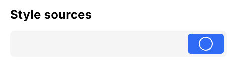
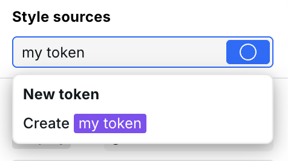
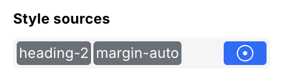
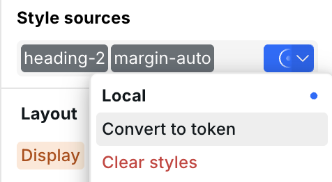
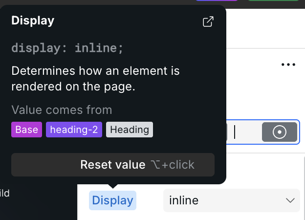
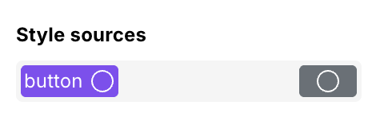

# 🖌️ Design tokens



## Why Tokens instead of classes? <a href="#introduction" id="introduction"></a>

If you’ve ever made a website with CSS or with Webflow, you’ve used “classes” to manage your website’s layout and visual styles. Sometimes we love classes. They give us a way to re-use styles which saves us valuable time. However, they have some limitations that make classes very frustrating to use in the context of visual development tools.

Scenario: You’re building a website with Webflow. You have two separate elements, a button, and a card, and you want to give them the same box shadow. Buttons and cards have unique styles so they each already have a unique class. What do you do?

- A: Manually configure the box shadow on the existing Button and Card classes individually. With this option you’re doing the same thing twice. It would save time if we could reuse the box shadow styles.
- B: Apply the Box Shadow class on top of the existing Button and Card classes, making a combo class. Now you can’t edit the styles on Button or Card without first removing the Box Shadow class. Don’t forget to re-apply it! And good luck managing the classes on a different breakpoint. To edit the Button or Card classes you must first remove the Box Shadow combo class, then Webflow will kick you back to the desktop breakpoint, then you select the intended breakpoint again, then make your style changes, then re-apply the combo class. Experienced Webflowers know the pain.

There’s a better way. It’s Design tokens.

## What are Tokens? <a href="#what-are-design-tokens" id="what-are-design-tokens"></a>

A Webstudio **Token** is a reusable style source that can contain multiple
declarations and states. [Craft](../craft.md) calls it a **composite Token** to
distinguish it from individual values stored in CSS variables.

The Design Tokens Community Group also uses _design token_ for values in its
portable data format. Webstudio imports that format and represents its values
as CSS variables or Webstudio Tokens according to their type and intended use.

- **Mix-and-match Tokens freely**: You can apply as many Tokens as you want to an instance in any order. There is no combo class silliness and no limitations with breakpoints.
- **Portable input:** The [Design Tokens Community Group format](https://design-tokens.github.io/community-group/format/)
  provides a format that tools can exchange. Webstudio can import DTCG data and
  Figma Variables API exports.

## Import design tokens

Webstudio can import token data from the
[Design Tokens Community Group format](https://design-tokens.github.io/community-group/format/)
and Figma Variables API exports. Copy the JSON document, then paste it into the
Builder. Webstudio detects supported token documents and asks how to represent
them:

- **Design tokens** creates reusable style tokens for composite and
  unambiguous style values. Other primitive values become CSS variables.
- **CSS variables** imports the values as custom properties for use in
  individual styles.

The importer resolves aliases and supports Figma modes and DTCG composite
values such as borders, shadows, gradients, transitions, and typography. CLI
and MCP integrations can additionally select modes, import every mode with
qualified names, map token types to style properties, and apply a prefix or
breakpoint.

If an imported name conflicts with an existing token, choose how to continue:

- **Theirs** keeps the imported token under a name with a numeric suffix.
- **Ours** skips the incoming token and keeps the Project token.
- **Merge** writes incoming styles into the existing token, with incoming
  values taking priority.

Review imported tokens and CSS variables before applying them throughout the
Project, especially when the source contains multiple modes or aliases.

## How to use tokens <a href="#how-to-use-tokens-in-webstudio" id="how-to-use-tokens-in-webstudio"></a>

The workflow for styling Tokens in Webstudio is nearly the same as styling classes in Webflow, except better.

First, it's recommended to create [CSS variables](css-variables.md) to use within the Tokens.

You can style your site using Local or Tokens like this:

1. Select an instance. The **Style sources** field at the top of the Style panel shows its Local styles and Tokens.

   

2. To create a Token, select the Style sources field, enter a name, and press Enter.

   

3. Select the source you want to edit. The active source is highlighted, and new styles are written to that source.

   

Use the Local source for styles that apply only to the selected instance. You can convert Local styles into a reusable Token later.



Hover a property label to see which breakpoint and style source provides its current value. See [Label colors](anatomy-of-the-webstudio-builder.md#label-colors) for the full reference.



An empty circle means the source has no styles. A dot appears in the Local source after you add a style.



## Exporting human-readable classes

By default, Tokens are converted to atomic styles, significantly reducing the amount of CSS, ultimately leading to a faster-loading website.

While the majority of users aren't concerned with how the classes are output and should use atomic styles, they can be optionally disabled.

See [Atomic CSS](project-settings.md#atomic-css) for more info.

## Advanced Token Techniques

### Token composition

Combine multiple tokens to create flexible, modular designs:

1. **Base Token**: Contains core styles, such as `card` with padding,
   background, and border radius.
2. **Variant or size Tokens**: Contain only the declarations needed for a
   variation, such as `is-card-featured` or `card-small`.

Apply both to an instance: The styles merge, with later tokens overriding earlier ones for conflicting properties.

**Example:** A card system

- `card` Token: padding, background, and border radius
- `card-small` Token: smaller padding
- `is-card-featured` Token: accent border color

Apply `card` and `is-card-featured` for a featured card variant.

### Token Priority (Cascading)

When multiple tokens define the same property, **the rightmost token wins**:

```
[card] [small] [featured]
       ↑        ↑
       │        └── Takes priority for any shared properties
       └── Overrides card for any shared properties
```

This allows you to build up styles modularly while maintaining precise control.

### Local Overrides

To override token styles for a specific instance:

1. Apply your tokens
2. Drag **Local** to the end (rightmost position)
3. Add your override styles on Local

Since Local is rightmost, its styles take priority over the tokens.

### Resetting Values

To remove a style from a specific token or Local:

1. Select the token in Style Sources
2. Hover over the property label
3. Click the reset icon (or use Option+click on Mac)

This removes the property from that specific token, allowing inherited values to show through.

### Duplicating Tokens

Create variations from existing tokens:

1. Select the token in Style Sources
2. Open the token menu (three dots)
3. Choose **Duplicate**
4. Rename and modify the duplicate

This is faster than creating tokens from scratch when building design systems.

### Token Conflict Resolution

When pasting content from another project or copying between pages, Webstudio intelligently handles token conflicts:

**Automatic Resolution**

- If a pasted token has the same name AND same styles as an existing token, they're automatically merged
- This prevents duplicate tokens when copying similar components

**Numeric Suffix**

- If a pasted token has the same name but different styles, a numeric suffix is added (e.g., "Button" becomes "Button-1")
- This preserves both your existing styles and the pasted styles

**Find Duplicate Tokens**
Use Commands & search (⌘+K) and search for "duplicate tokens" to find tokens with identical styles but different names. This helps clean up your token library.

## Related

- [States and selectors](states-and-selectors.md) – Style hover, focus, active states and pseudo-elements
- [CSS variables](css-variables.md) – Define reusable style values to use within Tokens
- [Anatomy of the Webstudio builder](anatomy-of-the-webstudio-builder.md) – Learn about the Style Panel and Style Sources
- [Project settings](project-settings.md) – Configure atomic CSS output
- [Commands & search](commands-and-search.md) – Quickly manage and search Tokens
