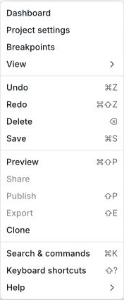
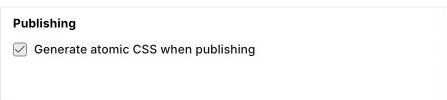
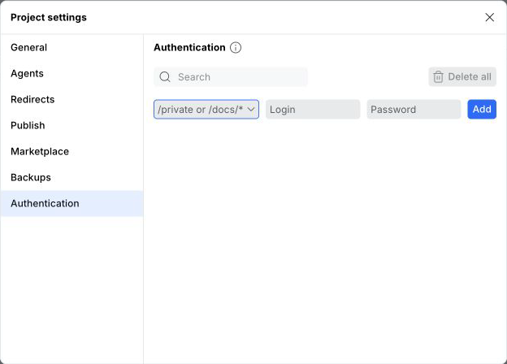

# ⚙️ Project settings

Project settings are located in the top left by clicking the Webstudio logo > Project settings.

<picture>
  <source media="(prefers-color-scheme: dark)" srcset="../../.gitbook/assets/project-settings-menu-dark.png">
  
</picture>

## General

* **Site Name** – Used to output [WebSite structured data](https://schema.org/WebSite) to clearly define your website's identity.
* **Favicon** – Output your logo in search engines, browser tabs, and more.
* **Custom Code** – Global field to output scripts in the head. Custom Code is often used to add analytics scripts such as Google Analytics, PostHog, Plausible, and any other scripts/code you want to output on every page. Please note that this code does _not_ output in the Builder, so your scripts aren't tracking Builder page views. For outputting a script in the body on every page, use a [Slot](../core-components/slot.md). For example, add [HTML Embed(s)](../core-components/html-embed.md) to your Footer Slot so that it outputs on every page.
* **Compiler** – Atomic CSS reduces the CSS file size by \~70% in many cases. See more below.

## Emails

Configure recipients, Sender, owner notification subject and plain-text body, and visitor confirmation subject and fixed plain-text body here. Recipients are comma-separated mailboxes such as `team@example.com` or `Name <address@example.com>`; quote a display name that contains a comma. When the list is empty, new Email Resources fall back to the project owner's address. An Email Resource can inherit these recipients or use its own fixed recipient list; submitted Form values cannot choose team recipients.

Visitor confirmation is enabled separately on each Form by selecting one named email input. Its recipient comes only from that field. Confirmation waits for all primary destinations to succeed and does not include other submitted values or attachments. The default confirmation body adds the published site's URL; an explicitly saved body is used exactly as written, even if its text matches the default. A failed confirmation is reported without reversing a successful Form submission.

Sender accepts one mailbox, with or without a display name: `Olegs Isonen <oleg008@gmail.com>` or `oleg008@gmail.com`. Its address is for replies, and its optional name is the display name. Webstudio's authenticated From address stays fixed. Each Email Resource can inherit Sender or override it.

The project owner body is the **complete** plain-text message. A nonempty body replaces the automatic Form data and browser information text and is used literally; it does not evaluate bindings typed into Project Settings. Leave it empty to use automatic text for a Form-scoped Email Resource, or edit that Resource's body expression to select Form fields and use bindings. A Resource outside the Form cannot bind that Form's data. Resetting a Resource body override restores inheritance of the project body.

Email Resources inherit project defaults until you override individual settings. Reset an override on the Resource to use the project value again. Republish to update the settings included in a published site. On Webstudio Cloud, a published site's Email Resource and visitor confirmation use the private Cloudflare Email Service when the `EMAIL_SERVICE` binding is configured. Saving settings or publishing does not itself send email; a visitor must submit the Form. Delivery fails explicitly if the service is unavailable. Self-hosted sites need a custom server-side email integration. The existing Contact email recipient setting continues to serve legacy Webhook Forms.

## Publishing

### Atomic CSS

<picture>
  <source media="(prefers-color-scheme: dark)" srcset="../../.gitbook/assets/atomic-css-setting-dark.png">
  
</picture>

When enabled, the class and CSS structure under the hood contains one style per class. This algorithm allows classes to be reused, significantly reducing the amount of CSS, ultimately leading to a faster-loading website.

For example, in the UI, you may create a Token called “Card” and give it a background color, padding, and a border-radius.

With atomic CSS _enabled_, it will output like this:

```css
  .ceszdr {
    background-color: #fff;
  }
  .c1jykks9 {
    border-top-left-radius: 1rem;
  }
  .c31r7mo {
    border-top-right-radius: 1rem;
  }
  .cywm6f1 {
    border-bottom-left-radius: 1rem;
  }
  .c1q77ydo {
    border-bottom-right-radius: 1rem;
  }
  .cu6yur2 {
    padding: 20px;
  }
```

Even though this seems to take up more space, its benefits become apparent as you style more parts of the website. Now, anytime you add 20px of padding, it’ll automatically reuse the `cu6yur2` class. Generally speaking, there are somewhat of a finite amount of styles you’ll use on your website, so as the website gets bigger, the CSS file does _not_ grow proportionally – in fact, its growth slows down as the site gets bigger as it doesn’t need to continue creating classes for styles you’ve already used. Pretty neat.

#### The data

Let’s quantify the CSS file size savings when using atomic CSS on Webstudio.

* 4-page brochure website
  * With atomic: 21 KB
  * Without atomic: 75 KB
* 23-page SaaS website
  * With atomic: 23 KB
  * Without atomic: 83 KB

**In both cases, enabling atomic CSS reduces the file size by around 72%!**

#### Disabling atomic CSS

Even though atomic CSS improves website performance by reducing the CSS file size, there are use cases to disable it.

When exporting your Project to [self-host](../self-hosting/) it, you _may_ want to modify CSS and classes _outside_ of Webstudio. By disabling atomic CSS, your classes are human-readable, instead of using an optimized algorithm.


If you need classes to target but want to enable atomic CSS, you can add classes in the settings panel. These will always output exactly as they are entered. Watch [this short video](https://www.youtube.com/watch?v=\_1QSWHOtk08) to learn more.


When atomic CSS is disabled, your components will have two classes:

1. A default class, such as `w-box`
2. Your [Tokens](design-tokens.md) and Local Styles merged into another class

The same example from above looks like this when atomic is _disabled_:

```css
.w-box-1 {
    background-color: rgb(255, 255, 255);
    border-radius: 1rem;
    padding: 20px;
}
```

## Redirects

Redirects old URLs to new ones so that you don’t lose any traffic or search engine rankings. 301 and 302 status codes are available.

## Authentication

Use Authentication to require HTTP Basic Auth credentials for one or more routes on custom domains.

This is useful when you want to protect:

- A group of pages, such as `/private/*`
- Dynamic routes, such as `/blog/:slug`
- The home page, using `/`
- A route that does not map cleanly to one page setting

To add a protected route:

1. Open **Project settings**
2. Go to **Authentication**
3. Enter a route, such as `/private` or `/docs/*`, plus a login and password
4. Click **Add**
5. Publish the site

Routes use the shared [path pattern syntax](path-patterns.md). The guide explains how static paths, parameters, and wildcards match URLs.

<picture>
  <source media="(prefers-color-scheme: dark)" srcset="../../.gitbook/assets/project-settings-authentication-dark.png">
  
</picture>

Login and password rules:

- Login is required
- Password is required
- Login cannot contain `:`
- Login and password cannot contain whitespace
- Password can contain `:`

If a page has authentication in Page Settings and the same route is also protected in Project Settings, the page setting takes priority for that route.


Authentication applies to protected routes on custom domains. Staging domains have their own built-in password protection, described in [Publishing & custom domains](publishing-and-custom-domains.md#staging-password-protection).



Authentication is a Pro feature for custom domains. You can publish to staging for free, but publishing authentication to custom domains requires a plan that includes it.


For a single page, you can also configure authentication directly in [Page settings](page-settings.md#authentication).

## Headers

Configure [HTTP response headers](response-headers.md) to set browser and CDN behavior for your published site. You can apply a header to every route or only to matching paths. Webstudio Cloud supplies framing and referrer defaults when you have not set your own values; platform-managed headers cannot be changed here.

## Marketplace

You can contribute free or paid templates by creating a Project and submitting it for review. Approved templates will appear in the [Marketplace](../marketplace.md).

For more information, see [Contributing to the Marketplace](../../contributing/marketplace.md).

## Related

- [SEO settings](seo-settings.md) – Configure meta tags and social sharing
- [Publishing & custom domains](publishing-and-custom-domains.md) – Deploy your site and manage domains
- [Page settings](page-settings.md) – Configure authentication for a single page
- [Design tokens](design-tokens.md) – Understand atomic CSS output options
- [Head Slot](../core-components/head-slot.md) – Add custom code per page
- [HTML Embed](../core-components/html-embed.md) – Embed analytics and custom scripts
