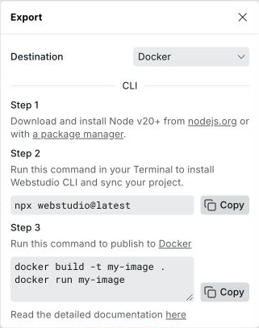
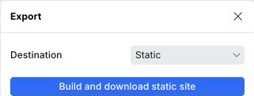

# ▶️ Download

The Webstudio Builder has a button that lets you download a static version of your site.


See [export types](./#export-types) for more information about JavaScript applications vs. static sites.


## Downloading your project

1. Select **Publish** in the top bar.
2. Select **Export**.

<picture>
  <source media="(prefers-color-scheme: dark)" srcset="../../.gitbook/assets/export-dark.png">
  
</picture>

3. Set **Destination** to **Static**.
4. Select **Build and download static site**.

<picture>
  <source media="(prefers-color-scheme: dark)" srcset="../../.gitbook/assets/build-and-download-static-site-dark.png">
  
</picture>

5. Wait while Webstudio builds and downloads the project.

The export contains a static site consisting of HTML, CSS, JS, and images ready to be uploaded to another platform.

See [static site hosting platforms](./#platforms-for-static-sites) we have documented.

## Related

- [Static Export](https://webstudio.is/static) – Learn more about static site export in Webstudio
- [CLI](../cli.md) – Export and build your project using the command line
- [Cloudflare Pages](./cloudflare-pages.md) – Deploy static sites to Cloudflare's network
- [GitHub Pages](./github-pages.md) – Free static site hosting from GitHub
- [Netlify](./netlify.md) – Deploy static sites to Netlify
- [Publishing and custom domains](../foundations/publishing-and-custom-domains.md) – Set up custom domains for your site
