# Figma Design Tokens

We use [Tokens Studio for Figma](https://docs.tokens.studio) plugin to sync design tokens between Figma and our code.

- [`__generated__/figma-design-tokens.json`](../src/__generated__/figma-design-tokens.json) — this file is synced with Figma by the plugin.
- [`__generated__/figma-design-tokens.ts`](../src/__generated__/figma-design-tokens.ts) — this file is generated from `figma-design-tokens.json` by [`transform-figma-tokens.ts`](../bin/transform-figma-tokens.ts) and contains data in format ready to be used in code.

### Generating Access Token for sync

1. Create a GitHub account if you don't have one.
2. Ask Oleg to add you to the `@webstudio-is/core` team if you are not already in it.
3. Go to https://github.com/settings/personal-access-tokens/new
   - Under "Resource owner" choose "webstudio-is"  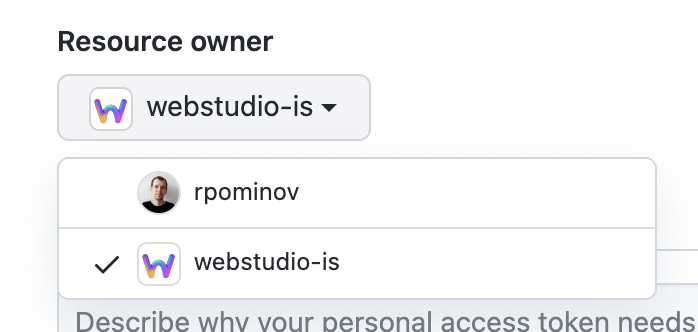
   - Under "Repository access" choose `webstudio-is/webstudio`  
   - Set "Repository permissions" / "Contents" to "Read and write", and leave other permissions as is  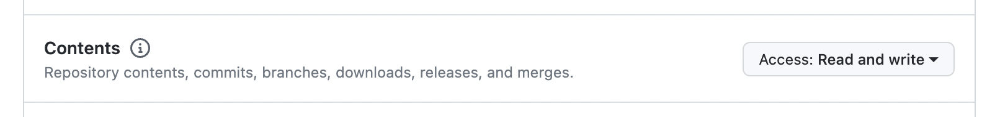
   - Press "Generate token and request access"
   - COPY THE TOKEN NOW AND SAVE IT SOMEWHERE SAFE (you won't be able to see it again)
4. Ask Oleg to approve your token using [this instruction](https://docs.github.com/en/organizations/managing-programmatic-access-to-your-organization/managing-requests-for-personal-access-tokens-in-your-organization).

### Syncing via plugin UI

1. Open a Figma file with design tokens, such as: https://www.figma.com/file/xCBegXEWxROLqA1Y31z2Xo/%F0%9F%93%96-Webstudio-Design-Docs
2. Click "Resources" in the topbar, then "Plugins" > "Tokens Studio for Figma" > Run  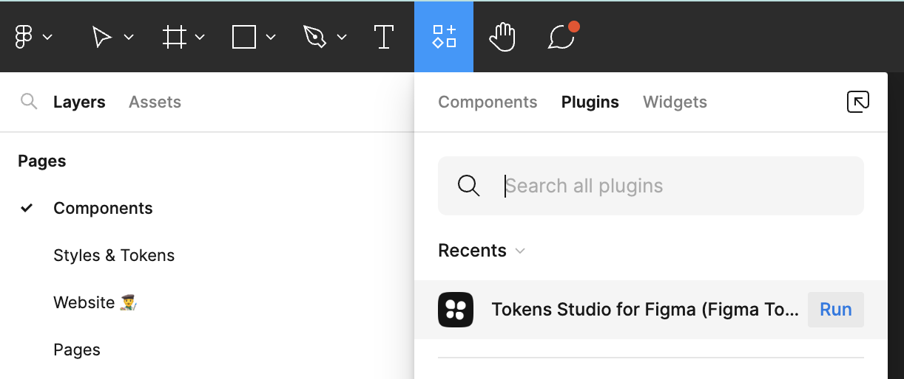
3. You might be asked for an access token. You can generate one by following the instructions above, or ask someone to share theirs (not recommended).
4. You should be able to sync with GitHub using ↧ and ↥ buttons at the bottom of the plugin window.  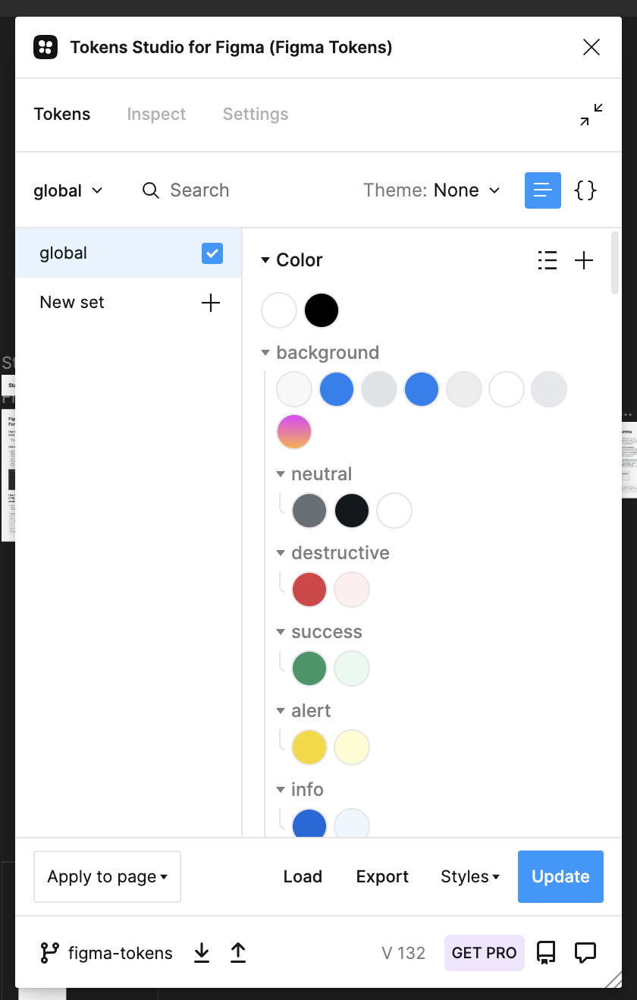

In case sync provider is not configured in the plugin, you can add one using these settings:

- Name: up to you
- Personal Access Token: token generated using the instructions above
- Repository: `webstudio-is/webstudio`
- Branch: `figma-tokens`
- File Path: `packages/design-system/src/__generated__/figma-design-tokens.json`
- baseUrl: leave empty

### Creating a Pull Request

After you've synced the tokens, the updates will be applied in the `figma-tokens` branch but not in the `main` branch yet. To merge the changes into `main`, you need to create a Pull Request.

You don't have to create the Pull Request after every sync, you can do a bunch of syncs and then create a single PR with all the changes.

Only one PR can be open at a time. If a PR is already open, you can continue to do syncs and the changes will be added to the existing PR.

The process:

1. At the last step of the sync you should see a "Create Pull Request" button. Click it.  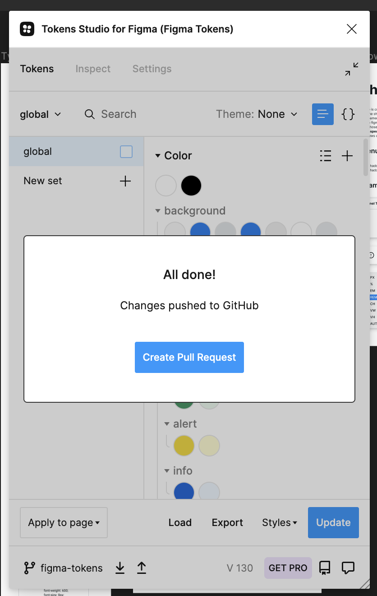
2. You'll be redirected to GitHub. Enter any title and description. You can describe the changes if they are not obvious.
3. Assign some reviewers. Feel free to always assign me (@rpominov). A Pull Request can't be merged without at least one review. Also you might need a developer's help if you've renamed or removed a token that was used in code.  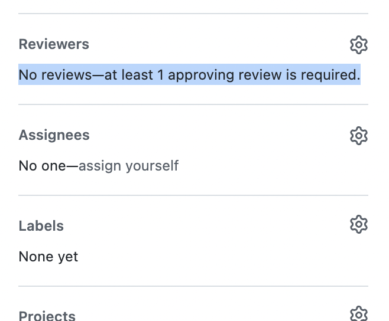
4. Click "Create pull request" button. (It might be hidden behind "Draft pull request")  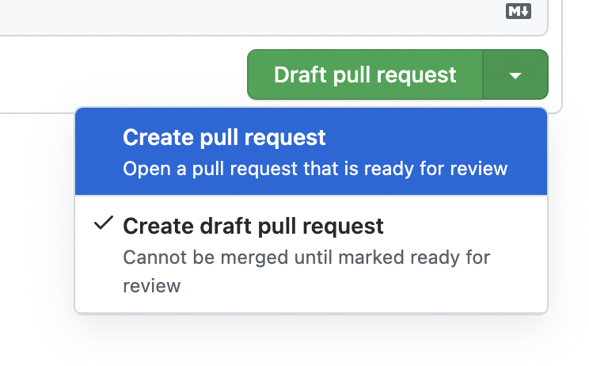
5. In the PR you can already see the changes in the deployed app  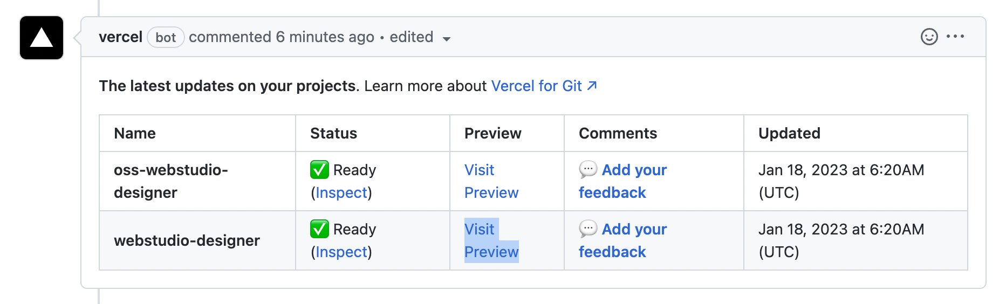
6. Also, you can see the cnahges in a Storybook using this link https://figma-tokens--638affb61acca1e593c6e558.chromatic.com/ or by going to the bottom of PR page > "Show all checks" > "Storybook Publish: !webstudio-is/webstudio" > "Details"  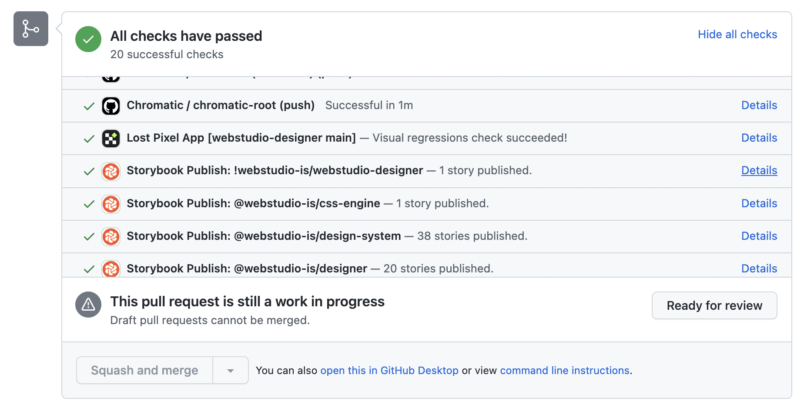
7. If you see "This branch is out-of-date with the base branch" message at the bottom, this means that when you look at the changes with the links above, you see all your changes applied, but some of the changes made by developers might not be applied. To fix that, click "Update branch" button, but make sure to choose "Update with merge commit"  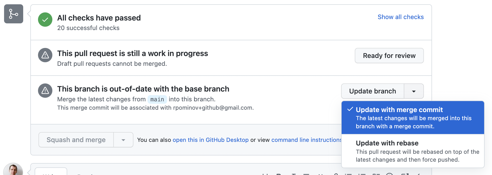
8. Sometimes a visual regression test may fail in the PR. Next sections describes how to fix it.

### Reviewing failed visual regression tests

1. At the bottom of the PR you may see a failed "Lost Pixel" check. Click on "Details"  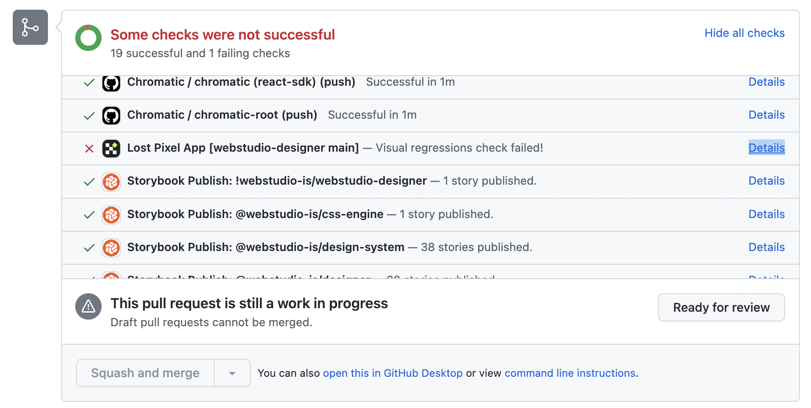
2. You'll be redirected to lost-pixel.com and it should ask you to login with your GitHub account.
3. After you login you should see a page like this, if not, repeat step 1  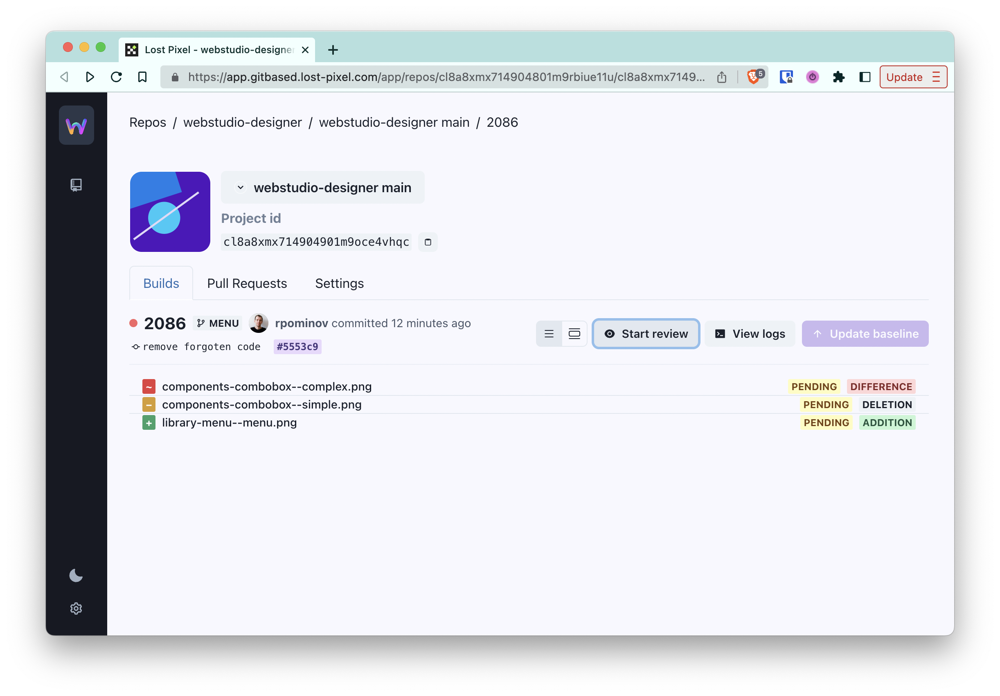
4. Click on "Start review". You'll be presented with series of before/after screenshots of our demos  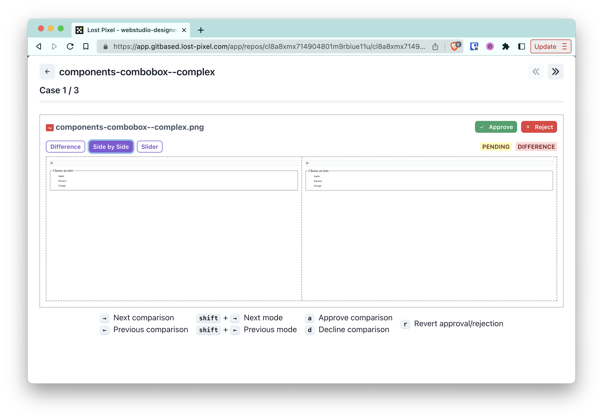
5. Approve each screenshot unless there's something wrong
6. If everything is fine, click "Update baselines"  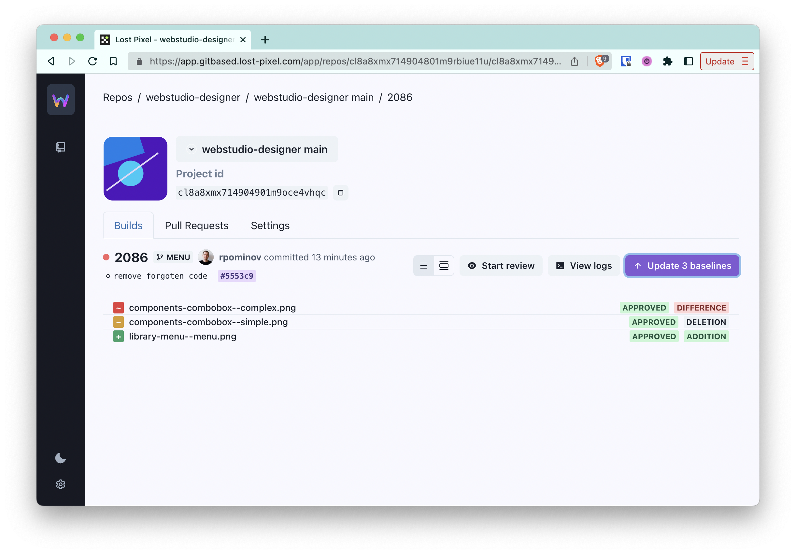
7. An "update lost pixel baseline" commit should appear in the PR and the failed check should pass  

### Links

- https://docs.tokens.studio/sync/github — documentation on sync with GitHub by plugin authors
- https://github.com/tokens-studio/figma-plugin/issues/1285 — why we use fine-grained tokens unlike what the documentation above suggests
